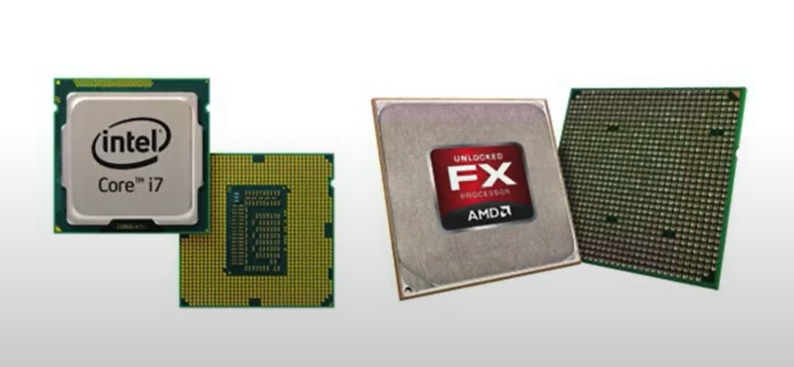
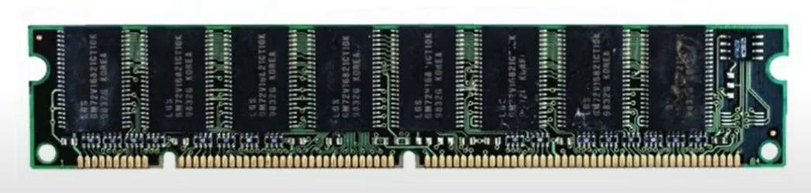
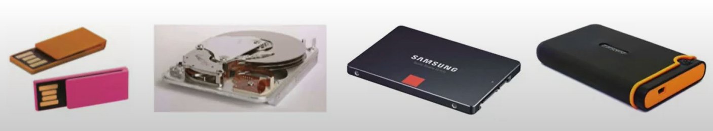
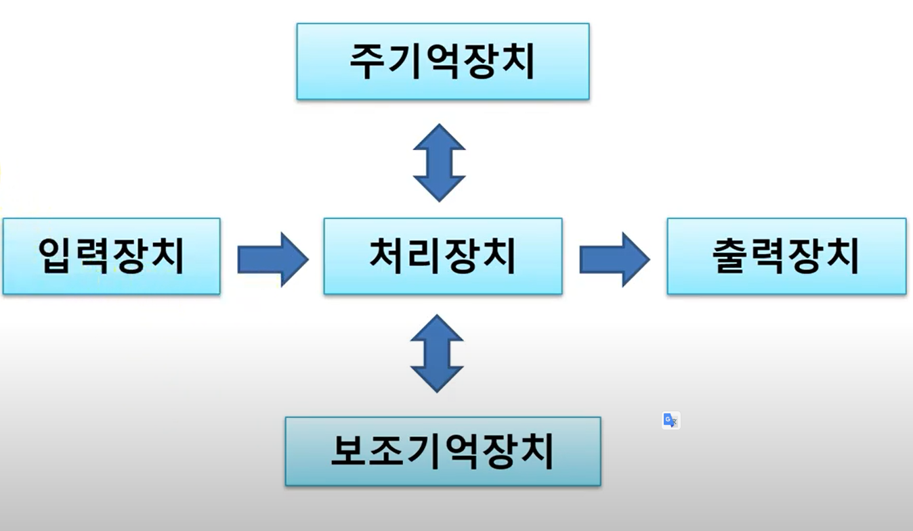
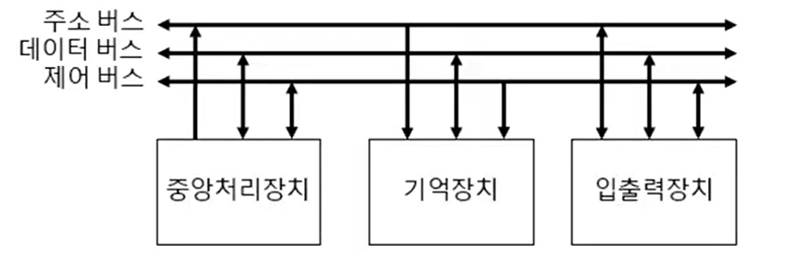

# 컴퓨터의 구성

## 컴퓨터

- 전자적으로 계산을 수행하는 장치
- 기능
  - 입력(input), 저장(store), 처리(process), 출력(output)
- 정의
  - 원하는 결과를 얻기 위해 입력기능을 이용하여 데이터를 0, 1의 디지털로 변환하고 저장 및 처리 기능을 이용하여 데이터를 처리하며 변환된 정보를 출력기능을 이용하여 적절한 출력장치로 출력할 수 있는 전자적 장치
- 구성 요소
  - 하드웨어(Hardware)
    - 데이터의 입력, 처리, 저장, 출력을 제어하는데 사용되는 물리적인 기계 장치
  - 소프트웨어(Software)
    - 컴퓨터가 수행할 작업을 지시하는 전자적 명령어들의 집합(프로그램)

## 하드웨어

- 입력장치

  - 데이터를 입력받는 장치
  - 키보드, 마우스, 터치스크린, POS(Point Of Sale) 시스템(편의점 포스), T-money 교통카드 입력장치, 광학 마크 판독기(OMR: Optical Mark Reader) 등등

- 처리장치

  - 데이터를 처리하는 장치
  - 중앙처리장치(CPU: Central Processing Unit)
    - 마이크로프로세서(Microprocessor) 혹은 프로세서(Processor)
    - 내부 구성
      - 제어장치 (Control Unit)
      - 연산장치 (Arithmetic Logic Unit)
      - 레지스터 (Register)

  

- 저장장치

  - 주기억장치 = 메모리(Memory)

    - CPU에서 처리 중인 프로그램과 데**이터를 임시로 저장**하기 위한 장치

    - RAM(Random Access Memory)

      - 메모리의 임의의 위치에 데이터를 쓰거나 읽을 수 있음

      - 휘발성

      - 듀얼 인라인 메모리 모듈(DIMM: Dual In-line Memory Module)

        

    - ROM(Read Only Memory)

      - 한번만 쓰기 가능
      - 읽기 전용 메모리

  - 보조기억장치 = 스토리지(storage)

    - 프로그램이나 데이터를 저장하기 위한 저장 공간

    - 주기억장치보다 속도 느림

    - 용량 대비 가격 저렴

    - 종류

      - USB 메모리
      - 하드 디스크(HDD: Hard Disk Drive)
      - SSD(Solid State Disk)
      - 외장형 하드 디스크 드라이브(External Hard Disk Drive)

      

  - 출력장치

    - 데이터 처리 결과를 사용자가 사용 가능한 형태나 최종적인 형태로 바꿔주는 장치
    - 디스플레이(Display) = 모니터(Monitor)
      - LCD (Liquid Crystal Display)
      - LED (Light Emitting Diode)
    - 프린터 (Printer)
    - 플로터(Plotter)
    - 3D 프린터
    - 홀로그램

  

데이터를 입력장치를 통해 입력받음. -> 데이터가 처리장치로 넘어가 처리됨 -> 중간에 저장장치(주기억장치, 보조기억장치)에 넘어가 저장됨 -> 출력장치로 출력됨

## 소프트웨어

컴퓨터가 특정 작업을 수행할 수 있도록 해주는 전자적인 명령어 조합

- 시스템 소프트웨어
  - 운영체제(Operating System)
    - 컴퓨터 자원(하드웨어 및 소프트웨어 전체)을 관리하고 운영하는 프로그램
    - Windows, MacOS, Unix, Linux
  - 유틸리티
    - 바이러스 치료, 보안, 파일 압축 관련 프로그램
- 응용 소프트웨어
  - 사무용 소프트웨어
    - 워드프로세서, 파워포인트, 스프레드시트
  - 프로그램 개발 도구
    - 비주얼 스튜디오, 이클립스 등
  - 데이터베이스 관리 시스템
    - Oracle, SQL Server, MySQL

## 시스템 버스

중앙처리장치, 주기억장치, 입출력장치를 연결하는 선

각 구성요소(장치)가 다른 구성 요소로 데이터를 보낼 수 있도록 통로가 되어줌

- 구성

  - 주소버스, 데이터버스, 제어버스로 구성되어있음
  - 선 하나가 한 비트를 전달
  - 주소 버스
    - 기억장치 또는 입출력장치의 주소를 지정한다.
    - 기억장치 용량과 관련이 있다.
    - 주소버스는 중앙처리장치가 주기억장치나 입출력장치로 기억장치 주소를 전달하는 통로이기 때문에 '단방향' 버스임
  - 데이터 버스
    - 중앙처리장치와 기타 장치 사이에서 데이터를 전달하는 통로이고, 일반적으로 8의 배수이다.
    - 기억장치와 입출력장치의 명령어와 데이터를 중앙처리장치로 보내거나, 중앙처리장치의 연산 결과를 기억장치의 입출력장치로 보내는 '양방향 버스'
    - 데이터 버스 비트 수 = 레지스터 크기 = 단어 크기(word size)
  - 제어 버스
    - 중앙처리장치가 기억장치나 입출력장치에 제어 신로를 전달하는 통로
    - 주소 버스와 데이터 버스를 제외한 나머지 신호
    - 읽기 동작과 쓰기 동작을 모두 수행하기 때문에 '양방향' 버스임

  

  

- 제어 신호의 종류

  - 기억장치 제어
    - 기억장치 읽기(memory read)
    - 기억장치 쓰기(memory write)
  - 입출력장치 제어
    - 입출력 읽기(input 또는 I/O read)
    - 입출력 쓰기(output 또는 I/O write)
    - 인터럽트 요청(interrupt request)
    - 인터럽트 확인(interrupt acknowledge)
    - 버스 요청(bus request)
    - 버스 승인(bus grant)
  - 기타
    - 시스템 클럭(system clock)
    - 리셋(reset)
    - 전력선(power lines)

참고

[ICT개론 - 컴퓨터 개요, 구성요소, 하드웨어 및 소프트웨어](https://www.youtube.com/watch?v=x5Um9xwvrjM)

[컴퓨터의 구성](https://gyoogle.dev/blog/computer-science/computer-architecture/%EC%BB%B4%ED%93%A8%ED%84%B0%EC%9D%98%20%EA%B5%AC%EC%84%B1.html)

[시스템버스](https://www.youtube.com/watch?v=12vWGyhYT2Q)

