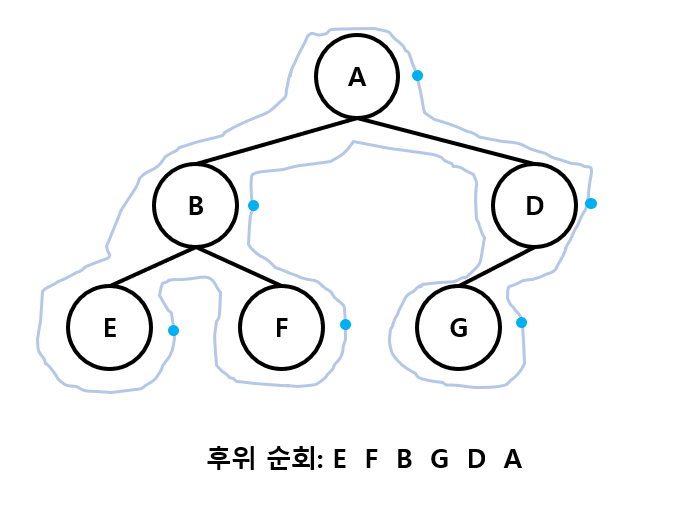

# 트리


한 개 이상의 노드와 그 노드들 간을 간선으로 연결한 비선형 구조이다. 상위 노드에 0개 이상의 하위 노드들이 연결되는 1:N 관계를 가지고 있어 확장되는 트리(나무) 모양의 구조를 말한다. 상위 노드에서 하위노드들을 분리했을때, 각각은 다시 새로운 트리로 정의될 수 있다.

- **노드(node, vertex)** : 트리의 원소
- **간선(edge)**: 노드를 연결하는 선. 부모노드와 자식 노드를 연결
- **루트 노드(root node)**: 트리의 시작 노드
- **형제노드(sibling node)**: 같은 부모 노드의 자식 노드들
- **조상 노드**: 간선을 따라 루트 노드까지 이르는 경로에 있는 모든 노드들
- **서브 트리(subtree)**: 부모 노드와 연결된 간선을 끊었을 때 생성되는 트리
- **자손 노드**: 서브 트리에 있는 하위 레벨의 노드
- **단말 노드(leaf node)**: 차수가 0인 노드. 자식노드가 없는 노드
- **차수(degree)**: 자식 노드의 수
  - 노드의 차수: 노드에 연결된 자식의 노드의 수
  - 트리의 차수: 트리에 있는 차수 중에서 가장 큰 값
- **높이(level, 깊이)**: 0부터 시작하여 노드까지 이르는 간선의 수
  - 노드의 높이 : 루트에서 노드에 이르는 간선의 수. 노드의 레벨
  - 트리의 높이: 트리에 있는 노드 높이 중에서 가장 큰 값. 최대 레벨

# 이진 트리


모든 노드들이 최대 2개의 서브트리를 갖는 트리 구조. 즉, 각 노드가 자식 노드를 최대한 2개까지만 가질 수 있다. 

- 레벨 i 에서의 노드의 최대 개수는 2<sup>i</sup> 개
- 높이가 h인 이진 트리가 가질 수 있는 노드의 최소 개수는 (h+1), 최대 개수는 (2<sup>h+1</sup> - 1) 개


## 포화 이진 트리(Full Binary Tree)


모든 레벨에 노드가 포화상태(자식노드가 2개)로 차 있는 이진 트리

- 높이가 h일 때, 최대의 노드 개수인 2<sup>h+1</sup> - 1개의 노드를 가진 이진 트리
- 루트를 1번으로 하여 2<sup>h+1</sup> - 1번까지 정해진 위치에 대한 노드 번호를 가짐


## 완전 이진 트리(Complete Binary Tree)


높이가 h이고 노드 수가 n개 일 때, 포화 이진 트리의 노드 번호 1번 부터 n번까지 빈 자리가 없는 이진 트리


## 편향 이진 트리(Skewed Binary Tree)


높이 h에 대한 최소 개수의 노드를 가지면서 한쪽 방향의 자식 노드만을 가진 이진 트리
- 왼쪽 편향 이진 트리
- 오른쪽 편향 이진 트리

​	→ 엣지 케이스(최악의 시간복잡도)로 사용


## 순회(traversal)

**트리의 각 노드를 중복되지 않게 전부 방문(visit) 하는 것**을 말하는데, 트리는 비 선형 구조이기 때문에 선형구조에서와 같이 선후 연결 관계를 알 수 없다


- **전위순회**(preorder traversal, **VLR**): 부모노드, 왼쪽 자식 노드, 오른쪽 자식 노드를 순으로 방문한다.
- **중위순회**(inorder traveral, **LVR**): 왼쪽 자식노드, 부모노드, 오른쪽 자식 노드 순으로 방문한다.
- **후위순회**(postorder traversal, **LRV**): 왼쪽 자식노드, 오른쪽 자식 노드, 부모노드 순으로 방문한다.

### 전위 순회(preorder traversal)


> 노드의 왼쪽에 점을 찍고 그 점을 이으면, 그 순서대로 전위 순회가 된다

#### 수행 방법

1. 현재 노드 n을 방문하여 처리한다
2. 현재 노드 n의 왼쪽 서브트리로 이동한다
3. 현재 노드 n의 오른쪽 서브트리로 이동한다

#### 알고리즘

```python
def preorder_traverse(T):
    if T: # T is not none
        visit(T)
        preorder_traverse(T.left)
        preorder_traverse(T.right)
```

### 중위순회(inorder traversal)


> 노드의 가운데 아래에 점을 찍고 그 점을 이으면, 그 순서대로 중위 순회가 된다

#### 수행 방법

1. 현재 노드 n의 왼쪽 서브트리로 이동한다
2. 현재 노드 n을 방문하여 처리한다
3. 현재 노드 n의 오른쪽 서브트리로 이동한다

#### 알고리즘

```python
def inorder_traverse(T):
    if T: # T is not none
	      inorder_traverse(T.left)
        visit(T)
        inorder_traverse(T.right)
```

### 후위순회(postorder traversal)



> 노드의 오른쪽에 점을 찍고 그 점을 이으면, 그 순서대로 후위 순회가 된다

#### 수행방법

1. 현재 노드 n의 왼쪽 서브트리로 이동한다
2. 현재 노드 n의 오른쪽 서브트리로 이동한다
3. 현재 노드 n을 방문하여 처리한다

#### 알고리즘

```python
def postorder_traverse(T):
    if T: # T is not none
	      postorder_traverse(T.left)
        postorder_traverse(T.right)
        visit(T)
```


## 배열 표현


- 루트 번호를 1로 시작하여 각 노드의 번호를 왼쪽에서 오른쪽으로 2<sup>h</sup>부터 2<sup>h+1</sup>-1
- 노드 번호를 배열의 인덱스로 사용
  - 노드 번호가 i인 노드의 부모 노드 번호 : i//2
  - 노드 번호가 i인 왼쪽 자식 노드 번호: 2<sup>i</sup>
  - 노드 번호가 i인 왼쪽 자식 노드 번호: 2<sup>i</sup> + 1
  - 레벨 h의 노드 번호 시작 번호: 2<sup>h</sup>
- 높이가 h인 이진 트리를 위한 배열의 크기는(h는 0부터 시작)
  - 레벨 i의 최대 노드수는 2<sup>i</sup>
  - 따라서 1 + 2 + 4 + 8 + ... + 2<sup>i</sup> = 2<sup>h+1</sup>-1 (0 제외)

#### 참고

> 모든 트리의 번호가 순서대로 되어있지 않을 수도 있다.
>
> 루트 번호가 1번이 아닐 수도 있어서 루트 위치를 찾아야할 수도 있다.
>
> 부모 노드가 자식 노드보다 작지 않을 수도 있다.
>
> 정점의 개수는 간선의 개수 + 1

```python
'''
4
1 2 1 3 3 4 3 5
'''
def pre_order(v):
  	if v: # 0번 정점이 없다는 가정하에 0번은 자식이 없는 경우를 표시
      	print(v)
        pre_order(ch1[v])
        pre_order(ch2[v])
        
def in_order(v):
    if v:
        in_order(ch1[v])
        print(v)
        in_order(ch2[v])

def post_order(v):
    if v:
        post_order(ch1[v])
        post_order(ch2[v])
        print(v)

E = int(input()) 	 # edge 수
arr = list(map(int, input().split())) # edge 배열(두개씩 한쌍)
V = E + 1 				# 정점 수

# 부모번호를 인덱스로 자식번호 저장
ch1 = [0]*(V+1)
ch2 = [0]*(V+1)
for i in range(E):
  	p, c = arr[i*2], arr[i*2+1]
  	if ch1[p] == 0: # 아직 자식이 없는 경우
    		ch1[p] = c
    else:
      	ch2[p] = c
pre_order(1)  # 12345
in_order(1)   # 21435
post_order(1) # 24531

# 자식번호를 인덱스로 부모번호 저장
par = [0]*(V+1)
for i in range(E):
  	p, c = arr[i*2], arr[i*2+1]
  	par[c] = p

# root 찾기
root = 0
for i in range(1, V+1):
  	if par[i]==0:
    		root = i
        break
in_order(2) # 12345

# 조상 찾기
c = 5
anc = []
while par[c] != 0:
  	anc.append(par[c])
    c = par[c]
```


## 연결리스트 표현


이진 트리의 모든 노드는 최대 2개의 자식 노드를 가지므로 일정한 단순 연결 리스트 노드를 사용하여 구현


## 수식 트리(Expression Binary Tree)


수식을 표현하는 이진트리

- 연산자는 루트 노드이거나 가지노드, 피연산자는 모두 리프노드
- 수식 트리의 순회 방법에 따라 각 식의 표기법이 달라질 수 있음


## 이진 탐색 트리


#### 특징

- **모든 원소는 서로 다른 유일한 키**를 갖는다
- key(왼쪽 서브트리) < key(루트노드) < key(오른쪽 서브트리)
- 왼쪽 서브트리와 오른쪽 서브트리도 이진 탐색 트리다
- 중위 순회하면 오름차순으로 정렬된 값을 얻을 수 있다

#### 탐색연산

1. 루트에서 시작한다
2. 탐색할 키 값 x를 루트 노드의 키값과 비교한다
   - (키값 x = 루트노드의 키값) 인 경우: 원하는 원소를 찾았으므로 탐색연산 성공
   - (키값 x < 루트노드의 키값) 인 경우: 루트노드의 왼쪽 서브트리에 대해서만 탐색연산 수행
   - (키값 x > 루트노드의 키값) 인 경우: 루트노드의 오른쪽 서브트리에 대해서 탐색 연산 수행
3. 서브트리에 대해서 순환적으로 탐색 연산을 반복한다

#### 삽입 연산

 	1. 먼저 탐색 연산을 수행
     - 삽인할 원소와 같은 원소가 트리에 있으면 삽입할 수 없으므로, 같은 원소가 트리에 있는지 탐색하여 확인한다
     - 탐색에서 탐색 실패가 결정되는 위치가 삽입 위치가 된다
     - 항상 새로운 리프노드를 생성하게 된다
 	2. 탐색 실패한 위치에 원소를 삽입한다

#### 삭제 연산

## 힙

완전 이진트리에 있는 노드 중에서 키값이 가장 큰 노드나 키값이 가장 작은 노드를 찾기 위해서 만든 자료 구조

### 최대 힙(max heap)

- 키 값이 가장 큰 노드를 찾기 위한 완전 이진 트리
- 부모노드의 키값 > 자식노드의 키값
- 루트 노드: 키값이 가장 큰 노드

### 최소힙(min heap)

- 키 값이 가장 작은 노드를 찾기 위한 완전 이진 트리
- 부모노드의 키값 < 자식노드의 키값
- 루트 노드: 키값이 가장 작은 노드

### 삽입

1. 제일 마지막 위치(오른쪽 아래 노드)에 새로운 노드를 생성

### 삭제

힙에서는 루트 노드의 원소만을 삭제할 수 있다

루트 노드의 원소를 삭제하여 반환한다

힙의 종류에 따라 최대값 또는 최솟값을 구할 수 있다

1. 루트 노드의 원소 삭제 후 따로 보관
2. 마지막 노드 삭제 후 루트 노드에 키값 저장
3. 현재 루트 노드의 위치 찾기
   1. 자식 노드 중 큰 키값을 가진 자식 노드와 교환 반복

```python
'''
최대 100개의 정수가 키로 입력
최대힙
'''
def enq(n): # 삽입 구현
  	global last
    last += 1
    tree[last] = n # 완전이진트리 유지
    c = last 	# 새로 추가된 정점을 자식으로
    p = c//2  # 완전이진트리에서의 부모 정점 번호
    while p>=1 and tree[p] < tree[c]: 	# 부모 노드가 있고, 자식의 키값이 더 크면 교환
      	tree[p], tree[c] = tree[c], tree[p]
      	c = p
      	p = c//2

def deq():
		global last
    tmp = tree[1]	# 루트의 key 값 저장
    tree[1] = tree[last] # 마지막 정점의 키를 루트에 복사
    last -= 1 # 마지막 정점 삭제
    # 부모 > 자식 규칙 유지
    p = 1
    c = p * 2 # 왼쪽자식노드 번호
    while c <= last: # 왼쪽 자식이 있으면
      	if c+1<=last and tree[c]<tree[c+1]: # 오른쪽 자식이 있고, 오른쪽 자식이 왼쪽 자식보다 더 크면
        		c += 1 # 오른쪽 자식 선택
      	if tree[p] < tree[c]:	# 자식의 키값이 더 크면 교환
          	tree[p], tree[c] = tree[c], tree[p]
            p = c
            c = p * 2
        else:
          	break
    return tmp

  
# 완전이진트리에서의 순회
def pre_order(v):
  	global last
  	if v<=last: # 마지막 정점번호 이내
    		visit(v) # 부모 노드 방문
    		pre_order(v*2) # 왼쪽 자식정점 방문
    		pre_order(v*2+1) # 오른쪽 자식정점 방문
N =100
# 포화이진트리의 정점번호
tree = [0]*(N+1)
last = 0			# 마지막 정점 번호
enq(3)
enq(2)
enq(4)
enq(7)
enq(5)
enq(1)
print(tree[1])
enq(9)
while last>0:
  print(deq())
  print(tree[1])


```


