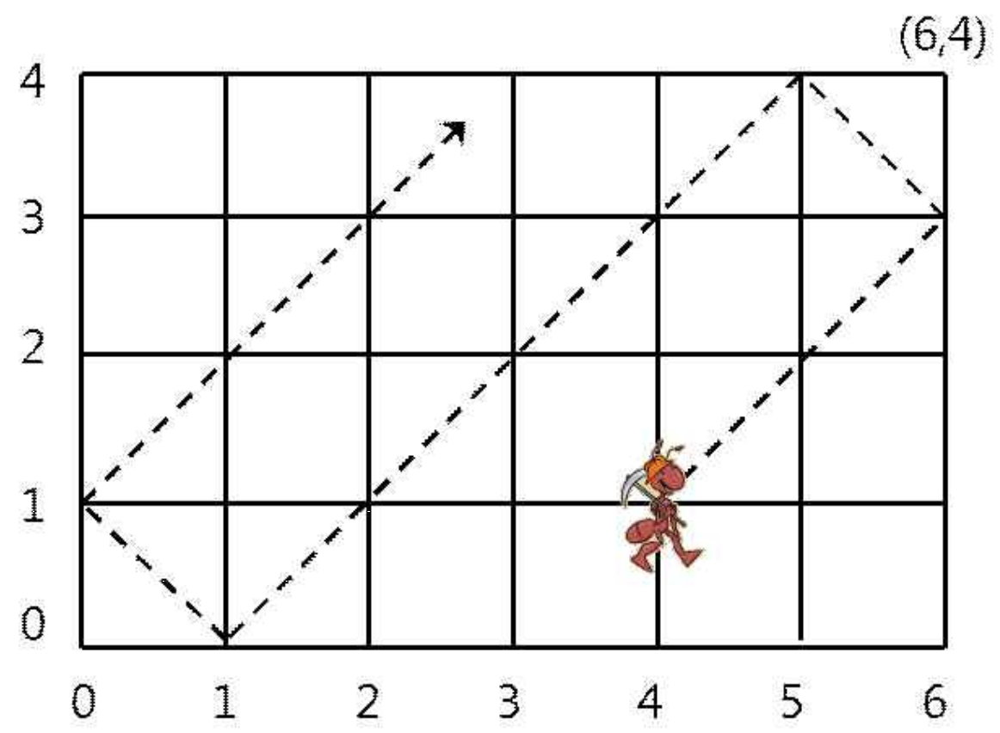

# 10158번: 개미

### 문제

> 가로 길이가 w이고 세로 길이가 h인 2차원 격자 공간이 있다. 이 격자는 아래 그림처럼 왼쪽 아래가 (0,0)이고 오른쪽 위가 (w,h)이다. 이 공간 안의 좌표 (p,q)에 개미 한 마리가 놓여있다. 개미는 오른쪽 위 45도 방향으로 일정한 속력으로 움직이기 시작한다. 처음에 (p,q)에서 출발한 개미는 1시간 후에는 (p+1,q+1)로 옮겨간다. 단, 이 속력으로 움직이다가 경계면에 부딪치면 같은 속력으로 반사되어 움직인다.
>
> 
>
> 위 그림은 6×4 격자에서 처음에 (4,1)에서 출발한 개미가 움직인 길을 보여주고 있다. 처음에 (4,1)에 있는 개미는 2시간 후에 (6,3)에 있으며 8시간 후에 (0,1)에 있다. 만일 그 개미가 처음에 (5,3)에 있었다면 매 시간마다 (6,4), (5,3), (4,2), (3,1)로 움직인다. 
>
> 여러분은 크기 w×h인 격자 공간에서 처음에 (p,q)에서 출발하는 개미의 t시간 후의 위치 (x,y)를 계산하여 출력해야 한다. 개미는 절대 지치지 않고 같은 속력으로 이동한다고 가정한다. 
>
> 문제에서 w와 h는 자연수이며 범위는 2 ≤ w,h ≤ 40,000이다. 그리고 개미의 초기 위치 p와 q도 자연수이며 범위는 각각 0 < p < w과 0 < q < h이다. 그리고 계산할 시간 t의 범위는 1 ≤ t ≤ 200,000,000이다. 


### 입력

> 첫줄에는 w와 h가 공백을 사이에 두고 주어진다. 그 다음 줄에는 초기 위치의 좌표값 p와 q가 공백을 사이에 두고 주어진다. 3번째 줄에는 개미가 움직일 시간 t가 주어진다. 


### 출력

> 출력은 t 시간 후에 개미의 위치 좌표 (x,y)의 값 x와 y를 공백을 사이에 두고 출력한다. 


### 문제 분석

>처음 위치(p,q)를 기준으로 (p+1, q+1)으로 움직인다.
>
>up, left 와 같은 불린 변수를 두어, 지금 현재 어떤 방향으로 가고 있는지 살핀다.
>
>- up이 True 면 y -> y+1, False면 y ->y-1
>- left가 True면 x-> x-1, False 면 x->x+1
>- 처음에는 up이 True, left가 False로 시작한다.
>
>튕겨내는 경우는 총 네가지 이다
>
>- (w,\*), (0,*)에 있을 때는 left의 bool 값을 바꾼다.
>- (\*, h), (*, 0)에 있을 때는 up의 bool 값을 바꾼다.
>
>-> 하나씩 오르는 건 시간초과
>
>- left가 True, up이 True일 때, (좌상) min(time, p, h-q) 만큼 p에서 빼고 q에 더한다
>- left가 False, up이 True일 때,(우상) min(time, w-p,h-q)만큼 p에 더하고 q에 더한다
>- left가 True, up이 False일 때,(좌하) min(time, p,q)만큼 p에서 빼고 q에서 뺀다
>- left가 False, up이 False일 때,(우하) min(time, w-p,q)만큼 p에 더하고 q에서 뺀다
>- time에서 각 최소값을 뺀다.
>
>-> 시간초과
>
>- 가로 방향: 현재 위치 p에서 w까지 간다음(time_p = time - (w-p))  
>  - 남은 time_p을 w로 나누어서 
>  - 몫이 홀수이면, 나머지에 위치해있다
>  - 몫이 짝수이면, 나머지를 w에서 뺀다 .
>- 세로 방향: 현재 위치 q에서 h까지 간다음(time_q = time - (h-q))
>  - 남은 time_q을 h로 나누어서
>  - 몫이 홀수이면, 나머지에 위치해있다.
>  - 몫이 짝수이면, 나머지를 h에서 뺀다


### 코드

```python
w, h = map(int,input().split())
p, q = map(int,input().split())
time = int(input())

up = True
left = False

for t in range(time):
    if p == 0 or p == w:
        left = not left
    if q == 0 or q == h:
        up = not up
    if up:
        q += 1
    else:
        q -= 1
    if left:
        p -= 1
    else:
        p += 1
print(p, q)
```

```python
w, h = map(int, input().split())
p, q = map(int, input().split())
time = int(input())

up = True
left = False

while time:
    if p == 0 or p == w:
        left = not left
    if q == 0 or q == h:
        up = not up
    # left가 True, up이 True일 때, (좌상) min(time, p, h-q) 만큼 p에서 빼고 q에 더한다
    if left and up:
        move = min(time, p, h-q)
        p -= move
        q += move
        time -= move
    # left가 False, up이 True일 때,(우상) min(time, w-p,h-q)만큼 p에 더하고 q에 더한다
    elif (not left) and up:
        move = min(time, w-p, h-q)
        p += move
        q += move
        time -= move
    # left가 True, up이 False일 때,(좌하) min(time, p,q)만큼 p에서 빼고 q에서 뺀다
    elif left and (not up):
        move = min(time, p, q)
        p -= move
        q -= move
        time -= move
    # left가 False, up이 False일 때,(우하) min(time, w-p,q)만큼 p에 더하고 q에서 뺀다
    else:
        move = min(time, w-p, q)
        p += move
        q -= move
        time -= move
print(p, q)
# 시간 초과
```

```python
w, h = map(int, input().split())
p, q = map(int, input().split())
time = int(input())

up = True
left = False

while time:
    if p == 0 or p == w:
        left = not left
    if q == 0 or q == h:
        up = not up
    # left가 True, up이 True일 때, (좌상) min(time, p, h-q) 만큼 p에서 빼고 q에 더한다
    if left and up:
        move = min(time, p, h-q)
        p -= move
        q += move
        time -= move
    # left가 False, up이 True일 때,(우상) min(time, w-p,h-q)만큼 p에 더하고 q에 더한다
    elif (not left) and up:
        move = min(time, w-p, h-q)
        p += move
        q += move
        time -= move
    # left가 True, up이 False일 때,(좌하) min(time, p,q)만큼 p에서 빼고 q에서 뺀다
    elif left and (not up):
        move = min(time, p, q)
        p -= move
        q -= move
        time -= move
    # left가 False, up이 False일 때,(우하) min(time, w-p,q)만큼 p에 더하고 q에서 뺀다
    else:
        move = min(time, w-p, q)
        p += move
        q -= move
        time -= move
print(p, q)
# 시간 초과
```

```python
w, h = map(int, input().split())
p, q = map(int, input().split())
time = int(input())

time_p = time - (w-p)
time_q = time - (h-q)

if time_p: 					# 남은 time_p가 있을 경우
    if (time_p // w) % 2: 	# w로 나눈 몫이 홀수이면(마지막에 왼쪽에서 오른쪽으로 움직임)
        p = time_p % w	 	# 나머지에 위치
    else:					# w로 나눈 몫이 짝수이면(마지막에 오른쪽에서 왼쪽으로 움직임)
        p = w - time_p % w	# w에서 나머지를 뺀 곳에 위치
else:						# 남은 time_p가 없을 경우(한번도 안 튕겼을 경우)
    p += time

if time_q: 					# 남은 time_q가 있을 경우
    if (time_q // h) % 2:	# h로 나눈 몫이 홀수이면(마지막에 아래에서 위로 움직임)
        q = time_q % h		# 나머지에 위치
    else:					# h로 나눈 몫이 짝수이면(마지막에 위에서 아래쪽으로 움직임)
        q = h - time_q % h	# h에서 나머지를 뺀 곳에 위치
else:
    q += time
print(p, q)
```


### 테스트 케이스

> ```bash
> 6 4
> 4 1
> 8
> # 0 1
> 
> 6 4
> 5 3
> 4
> # 3 1
> ```


### 출처

> https://www.acmicpc.net/problem/10158


### 알고리즘 분류

> - [수학](https://www.acmicpc.net/problem/tag/124)
> - [사칙연산](https://www.acmicpc.net/problem/tag/121)
> - [애드 혹](https://www.acmicpc.net/problem/tag/109)