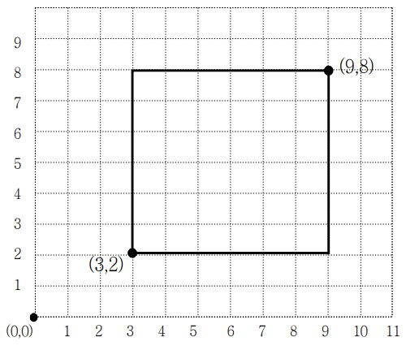
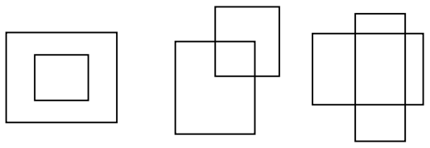
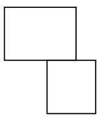
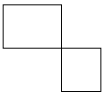
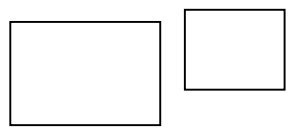

# 2527번: 직사각형

### 문제

> 2차원 격자공간에 두 개의 꼭짓점 좌표로 표현되는 직사각형이 있다. 직사각형은 아래와 같이 왼쪽 아래 꼭짓점 좌표 (x, y)와 오른쪽 위 꼭짓점 좌표 (p, q)로 주어진다.
>
> 
>
> 이 문제에서 모든 직사각형은 두 꼭짓점의 좌표를 나타내는 4개의 정수 x y p q 로 표현된다. 단 항상 x<p, y<q 이다. 예를 들어 위 그림에 제시된 직사각형이라면 아래와 같이 표현된다.
>
> **3 2 9 8**
>
> 두 개의 직사각형은 그 겹치는 부분의 특성에 따라 다음 4가지 경우로 분류될 수 있다. 
>
> 먼저 두 직사각형의 겹치는 부분이 직사각형인 경우이다. 아래 그림(a)는 공통부분이 직사각형인 경우의 3가지 예를 보여준다,
>
> 
>
> 그림 (a)
>
> 또는 겹치는 부분이 아래 그림 (b)와 같이 선분이 될 수도 있고, 그림 (c)와 같이 점도 될 수 있다. 
>
> 
>
> 그림 (b)
>
> 
>
> 그림 (c)
>
> 마지막으로 아래 그림 (d)와 같이 공통부분 없이 두 직사각형이 완전히 분리된 경우도 있다.
>
> 
>
> 그림 (d)
>
> 여러분은 두 직사각형의 겹치는 부분이 직사각형인지, 선분인지, 점인지, 아니면 전혀 없는 지를 판별해서 해당되는 코드 문자를 출력해야 한다. 
>
> | 공통부분의 특성 | 코드 문자 |
> | --------------- | --------- |
> | 직사각형        | a         |
> | 선분            | b         |
> | 점              | c         |
> | 공통부분이 없음 | d         |


### 입력

> 4개의 줄로 이루어져 있다. 각 줄에는 8개의 정수가 하나의 공백을 두고 나타나는데, 첫 4개의 정수는 첫 번째 직사각형을, 나머지 4개의 정수는 두 번째 직사각형을 각각 나타낸다. 단 입력 직사각형의 좌표 값은 1이상 50,000 이하의 정수로 제한된다. 


### 출력

> 4개의 각 줄에 주어진 두 직사각형의 공통부분을 조사해서 해당하는 코드 문자를 출력파일의 첫 4개의 줄에 각각 차례대로 출력해야 한다.


### 문제 분석

>두 개의 직사각형의 각 꼭짓점 x1, y1, p1, q1, x2, y2, p2, q2를 입력 받는다
>
>겹치는 직사각형의 좌표: x, y, p, q = (max(x1, x2), max(y1, y2), min(p1, p2), min(q1, q2))
>
>겹치는 부위가
>
>- 직사각형일 때, x < p and y < q
>
>- 선분일 때, (x <= p and y <= q) and ((x == p and y != q) or (x != p and y == q))
>- 점일 때, x == p and y == q
>
>- 없을때, 나머지.

### 코드

```python
for i in range(4):
    # 좌표입력
    x1, y1, p1, q1, x2, y2, p2, q2 = map(int, input().split())
    # 겹치는 부분의 좌표
    x, y, p, q = (max(x1, x2), max(y1, y2), min(p1, p2), min(q1, q2))
    
    # 직사각형일 때
    if x < p and y < q:
        print('a')
    # 선분일 때
    elif (x <= p and y <= q) and ((x == p and y != q) or (x != p and y == q)):
        print('b')
    # 점일 때
    elif x == p and y == q:
        print('c')
    # 없을 때
    else:
        print('d')
```


### 테스트 케이스

> ```bash
> 3 10 50 60 100 100 200 300
> 45 50 600 600 400 450 500 543
> 11 120 120 230 50 40 60 440
> 35 56 67 90 67 80 500 600
> #d
> #a
> #a
> #b
> ```

> ```bash
> # 직사각형 확인 모두 a가 나와야 함
> 3 3 5 5 4 4 6 6
> 3 3 5 5 2 4 4 6
> 3 3 5 5 2 2 4 4
> 3 3 5 5 4 2 6 4
> # 오른쪽 위
> # 왼쪽 위
> # 왼쪽 아래
> # 오른쪽 아래
> 1 1 4 4 2 2 3 3
> 2 2 3 3 1 1 4 4
> 1 2 4 3 2 1 3 4
> 2 1 3 4 1 2 4 3
> 
> # 선분 확인, 모두 b가 나와야 함.
> 1 1 4 4 3 4 5 5
> 1 1 4 4 2 4 3 5
> 1 1 4 4 0 4 2 5
> 1 1 4 4 0 3 1 4
> 
> 1 1 4 4 0 2 1 3
> 1 1 4 4 0 0 1 2
> 1 1 4 4 0 0 2 1
> 1 1 4 4 2 0 3 1
> 
> 1 1 4 4 3 0 5 1
> 1 1 4 4 4 1 5 2
> 1 1 4 4 4 2 5 3
> 1 1 4 4 4 3 5 5
> 
> # 점 확인 모두 c가 나와야 함
> 1 1 4 4 4 4 5 5
> 1 1 4 4 0 4 1 5
> 1 1 4 4 0 0 1 1
> 1 1 4 4 4 0 5 1
> 
> # 공통 부분 없음 모두 d가 나와야 함
> 2 2 3 3 3 4 5 5
> 2 2 3 3 2 4 3 5
> 2 2 3 3 0 4 2 5
> 2 2 3 3 0 3 1 4
> 
> 2 2 3 3 0 2 1 3
> 2 2 3 3 0 0 1 2
> 2 2 3 3 0 0 2 1
> 2 2 3 3 2 0 3 1
> 
> 2 2 3 3 3 0 5 1
> 2 2 3 3 4 1 5 2
> 2 2 3 3 4 2 5 3
> 2 2 3 3 4 3 5 5
> ```
>
> 

### 출처

> https://www.acmicpc.net/problem/2527


### 알고리즘 분류

> - [수학](https://www.acmicpc.net/problem/tag/124)
> - [기하학](https://www.acmicpc.net/problem/tag/100)
> - [많은 조건 분기](https://www.acmicpc.net/problem/tag/137)