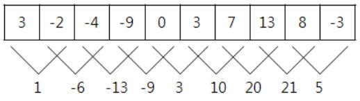
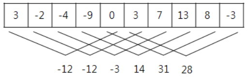

# 2559번: 수열

### 문제

> 매일 아침 9시에 학교에서 측정한 온도가 어떤 정수의 수열로 주어졌을 때, 연속적인 며칠 동안의 온도의 합이 가장 큰 값을 알아보고자 한다.
>
> 예를 들어, 아래와 같이 10일 간의 온도가 주어졌을 때, 
>
> 3 -2 -4 -9 0 3 7 13 8 -3
>
> 모든 연속적인 이틀간의 온도의 합은 아래와 같다.
>
> 
>
> 이때, 온도의 합이 가장 큰 값은 21이다. 
>
> 또 다른 예로 위와 같은 온도가 주어졌을 때, 모든 연속적인 5일 간의 온도의 합은 아래와 같으며, 
>
> 
>
> 이때, 온도의 합이 가장 큰 값은 31이다.
>
> 매일 측정한 온도가 정수의 수열로 주어졌을 때, 연속적인 며칠 동안의 온도의 합이 가장 큰 값을 계산하는 프로그램을 작성하시오. 


### 입력

> 첫째 줄에는 두 개의 정수 N과 K가 한 개의 공백을 사이에 두고 순서대로 주어진다. 첫 번째 정수 N은 온도를 측정한 전체 날짜의 수이다. N은 2 이상 100,000 이하이다. 두 번째 정수 K는 합을 구하기 위한 연속적인 날짜의 수이다. K는 1과 N 사이의 정수이다. 둘째 줄에는 매일 측정한 온도를 나타내는 N개의 정수가 빈칸을 사이에 두고 주어진다. 이 수들은 모두 -100 이상 100 이하이다. 


### 출력

> 첫째 줄에는 입력되는 온도의 수열에서 연속적인 K일의 온도의 합이 최대가 되는 값을 출력한다.


### 문제 분석

>사라지는 숫자와 시작하는 숫자의 크기 비교
>
><3 -2 -4 -9 0> 3 7 13 8 -3 3 처음 합을 구한다.
>
>앞에껄 빼고 뒤에껄 더합 값이 양수이어야 함
>
> 3 <-2 -4 -9 0 3> 7 13 8 -3 -(3) + 3 = 0 -> 제외
>
>양수이면 max 값을 바꾼다
>
>3 -2 <-4 -9 0 3 7> 13 8 -3 -(-2) + 7 = 9
>
>양수이면 max 값을 바꾼다
>
>3 -2 -4 <-9 0 3 7 13> 8 -3 -(-4) + 13 = 17
>
>양수이면 max 값을 바꾼다
>
>3 -2 -4 -9 <0 3 7 13 8> -3 -(-9) + 8 = 17
>
>음수이면 max 값을 그대로 두고 이전 두개의 값에 그 값을 더해준다.
>
>3 -2 -4 -9 0 <3 7 13 8 -3> -0 + -3 = -3


### 코드

```python
N, K = map(int, input().split())
degrees = list(map(int, input().split()))
max_degree = sum(degrees[:K]) # 최댓값 초기값 설정
two_sum = 0 # 사라질 숫자를 빼고 들어올 숫자를 더함

for i in range(N - K):
    # i번째 숫자는 다음 번에 빠질 숫자이고 i + K번째 숫자는 다음 번에 새롭게 들어올 숫자
    two_sum += - degrees[i] + degrees[i + K]
    if two_sum > 0: # 빠질 숫자보다 들어올 숫자가 크면 max_dree를 바꿔줌
        max_degree = sum(degrees[i + 1:i + 1 + K])
        two_sum = 0 # two_sum 초기화

print(max_degree)
```


### 테스트 케이스

> ```bash
> 10 2
> 3 -2 -4 -9 0 3 7 13 8 -3
> # 21
> 10 5
> 3 -2 -4 -9 0 3 7 13 8 -3
> # 31
> ```


### 출처

> https://www.acmicpc.net/problem/2559


### 알고리즘 분류

> - [누적 합](https://www.acmicpc.net/problem/tag/139)
> - [두 포인터](https://www.acmicpc.net/problem/tag/80)