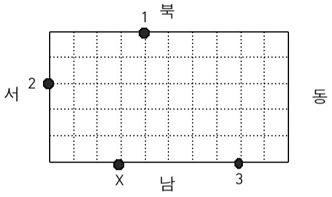

# 2564번: 경비원

### 문제

> 동근이는 무인 경비 회사 경비원으로 항상 대기하고 있다가 호출이 들어오면 경비차를 몰고 그 곳으로 달려가야 한다. 동근이가 담당하고 있는 곳은 직사각형 모양의 블록으로 블록 중간을 가로질러 차가 통과할만한 길이 없다. 이 블록 경계에 무인 경비를 의뢰한 상점들이 있다.
>
> 예를 들어 가로의 길이가 10, 세로의 길이가 5인 블록의 경계에 무인 경비를 의뢰한 3개의 상점이 있다고 하자. <그림 1>과 같이 이들은 1, 2, 3으로 표시되어 있고, 동근이는 X로 표시한 위치에 있다.
>
> 
>
> < 그림 1 >
>
> 1번 상점에서 호출이 들어 왔을 때 동근이가 블록을 시계방향으로 돌아 이동하면 이동 거리가 12가 된다. 반면 반시계방향으로 돌아 이동하면 이동 거리는 18이 된다. 따라서 동근이가 1번 상점으로 가는 최단 거리는 12가 된다. 마찬가지로 동근이의 위치에서 2번 상점까지의 최단 거리는 6, 3번 상점까지의 최단 거리는 5가 된다.
>
> 블록의 크기와 상점의 개수 및 위치 그리고 동근이의 위치가 주어질 때 동근이의 위치와 각 상점 사이의 최단 거리의 합을 구하는 프로그램을 작성하시오.


### 입력

> 첫째 줄에 블록의 가로의 길이와 세로의 길이가 차례로 주어진다. 둘째 줄에 상점의 개수가 주어진다. 블록의 가로의 길이와 세로의 길이, 상점의 개수는 모두 100이하의 자연수이다. 이어 한 줄에 하나씩 상점의 위치가 주어진다. 상점의 위치는 두 개의 자연수로 표시된다. 첫째 수는 상점이 위치한 방향을 나타내는데, 1은 블록의 북쪽, 2는 블록의 남쪽, 3은 블록의 서쪽, 4는 블록의 동쪽에 상점이 있음을 의미한다. 둘째 수는 상점이 블록의 북쪽 또는 남쪽에 위치한 경우 블록의 왼쪽 경계로부터의 거리를 나타내고, 상점이 블록의 동쪽 또는 서쪽에 위치한 경우 블록의 위쪽 경계로부터의 거리를 나타낸다. 마지막 줄에는 동근이의 위치가 상점의 위치와 같은 방식으로 주어진다. 상점의 위치나 동근이의 위치는 블록의 꼭짓점이 될 수 없다.


### 출력

> 첫째 줄에 동근이의 위치와 각 상점 사이의 최단 거리의 합을 출력한다.


### 문제 분석

>첫째 줄: 블록의 가로의 길이(p), 세로의 길이(q)
>
>둘째 줄: 상점의 수
>
>셋째 줄 ~: 상점 위치
>
>- 1 :블록의 북쪽
>- 2 : 블록의 남쪽
>- 3: 블록의 서쪽
>- 4: 블록의 동쪽
>- 블록의 남쪽 북쪽 -> 블록의 왼쪽 경계로부터의 거리
>- 블록의 동쪽, 서쪽 -> 블록의 위쪽 경계로부터의 거리
>
>마지막 줄: 동근이의 위치
>
>- 각 좌표를 한줄에 입력시킨다고 생각. 
>  - 각 끝이 (0,0)인 리스트로 생성
>  - 직사각형을 원이라고 생각
>  - (0,0) (1,0)...(p,q) ... (0,1) 총 2(p+q) 길이의 리스트
>
>- 상점 위치 입력 받을때, 
>
>  - 위치가 1, 3 이면 x+y 한 것이 인덱스
>  - 위치가 2, 4 이면 -(x+y) 한 것이 인덱스
>
>  - 들어가는 값은 몇번째 입력 값인지.
>
>- 동근이의 위치를 입력받으면 동근이의 위치를 기준으로 다시 배열을 만든다고 생각
>  - 동근이의 위치를 리스트에서 지정한다음. 
>  - 그 위치를 기준으로 잘라서
>  - 앞의 부분을 reverse 하고 뒤의 부분 앞에 합치기
>
>- 좌우 끝점이 0이라고 생각해서 해당 점의 위치까지의 길이 구하여 min값 찾기


### 코드

```python
import sys
def position_to_xy(line, num, p, q):
    if line == 1:
        xy = (num, q)
    elif line == 2:
        xy = (num, 0)
    elif line == 3:
        xy = (0, q - num)
    else: # line == 4
        xy = (p, q - num)
    return xy

p, q = map(int, input().split())
N = int(input())
circle = [0 for i in range(2 * (p + q))]

for order in range(1, N + 1):
    # line, num = map(int, sys.stdin.readline().strip().split())
    line, num = map(int, input().split())
    x, y = position_to_xy(line, num, p, q) # (x,y)로 형태로 바꿈
    if line == 1 or line == 3:# 북쪽 서쪽
        circle[x + y] = order
    else: # 남쪽 동쪽
        circle[-(x+y)] = order
line_d, num_d = map(int, input().split()) 
x_d, y_d = position_to_xy(line_d, num_d, p, q) # 동근이의 위치
# 동근이의 위치를 토대로 circle을 자름(시작점을 (0,0)에서 (x_d, y_d)로 바꿈)
if line_d == 1 or line_d == 3:# 북쪽 서쪽
    circle = circle[x_d + y_d:] + circle[:x_d + y_d]
else: # 남쪽 동쪽
    circle = circle[-(x_d+y_d):] + circle[:-(x_d+y_d)]

min_distance = 0
for order in range(1, N + 1):
    idx = circle.index(order)
    min_distance += min(idx, len(circle)-idx) # 좌우 길이 비교
print(min_distance)
```


### 테스트 케이스

> ```bash
> 10 5
> 3
> 1 4
> 3 2
> 2 8
> 2 3
> # 23
> 
> 4 3
> 3
> 1 2
> 3 1
> 4 2
> 2 2
> 
> # 동근이 위치이전 [0, 0, 2, 0, 0, 1, 0, 0, 0, 3, 0, 0, 0, 0]
> # 동근이 위치  [ 0, 0, 0, 0, 2, 0, 0, 1, 0, 0, 0, 3, 0, 0]
> 
> 4 3
> 3
> 1 2
> 3 1
> 4 2
> 3 1
> 
> # 동근이 위치이전 [0, 0, 2, 0, 0, 1, 0, 0, 0, 3, 0, 0, 0, 0]
> # 동근이 위치  [ 2, 0, 0, 1, 0, 0, 0, 3, 0, 0, 0, 0, 0, 0]
> ```


### 출처

> https://www.acmicpc.net/problem/2564


### 알고리즘 분류

> - [구현](https://www.acmicpc.net/problem/tag/102)
> - [많은 조건 분기](https://www.acmicpc.net/problem/tag/137)