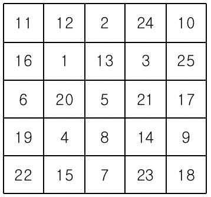
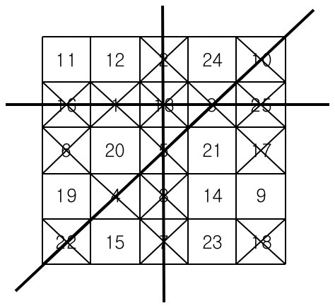

# 2578번: 빙고

### 문제

> 빙고 게임은 다음과 같은 방식으로 이루어진다.
>
> 먼저 아래와 같이 25개의 칸으로 이루어진 빙고판에 1부터 25까지 자연수를 한 칸에 하나씩 쓴다
>
> 
>
> 다음은 사회자가 부르는 수를 차례로 지워나간다. 예를 들어 5, 10, 7이 불렸다면 이 세 수를 지운 뒤 빙고판의 모습은 다음과 같다.
>
> 
>  
>
> 차례로 수를 지워가다가 같은 가로줄, 세로줄 또는 대각선 위에 있는 5개의 모든 수가 지워지는 경우 그 줄에 선을 긋는다.
>
> 
>
> 이러한 선이 세 개 이상 그어지는 순간 "빙고"라고 외치는데, 가장 먼저 외치는 사람이 게임의 승자가 된다.
>
> 
>
> 철수는 친구들과 빙고 게임을 하고 있다. 철수가 빙고판에 쓴 수들과 사회자가 부르는 수의 순서가 주어질 때, 사회자가 몇 번째 수를 부른 후 철수가 "빙고"를 외치게 되는지를 출력하는 프로그램을 작성하시오.


### 입력

> 첫째 줄부터 다섯째 줄까지 빙고판에 쓰여진 수가 가장 위 가로줄부터 차례대로 한 줄에 다섯 개씩 빈 칸을 사이에 두고 주어진다. 여섯째 줄부터 열째 줄까지 사회자가 부르는 수가 차례대로 한 줄에 다섯 개씩 빈 칸을 사이에 두고 주어진다. 빙고판에 쓰여진 수와 사회자가 부르는 수는 각각 1부터 25까지의 수가 한 번씩 사용된다.


### 출력

> 첫째 줄에 사회자가 몇 번째 수를 부른 후 철수가 "빙고"를 외치게 되는지 출력한다.


### 문제 분석

>처음 입력값을 토대로 딕셔너리에 넣는다. 
>
>그다음 입력값을 모두 사회자 리스트에 넣는다.
>
>12개짜리 리스트를 만들고 모든 초기값을 0으로 지정한다.
>
>가로줄 0~4까지, 세로줄은 5~9까지, 대각선은 10~11 인덱스에서 카운트 한다.
>
>예를 들어, (0,0) 에 위치한 수가 불렸을 경우,  
>
>가로줄 0번, 세로줄 5번 대각선 10번의 값에 +1을 한다.
>
>(3,4)에 위치한 수가 불렸을 경우,
>
>가로줄 3번, 세로줄 9번에 값에 +1을 한다.
>
>매번 값이 +5인 줄의 개수를 세서, 3개 **이상**일경우 bingo를 외친다.


### 코드

```python
nums = {}
called_nums = []
bingos = [0 for i in range(12)]

# 빙고판 만들기
for i in range(5):
    tmp = list(map(int, input().split()))
    for j in range(5):
        nums[tmp[j]] = (i, j)

# 사회자가 불러주는 숫자 저장하기
for i in range(5):
    called_nums += list(map(int, input().split()))

# 사회자가 번호 하나씩 부르기
for turn, called in enumerate(called_nums):
    # 불러준 숫자의 위치를 찾는다.
    i, j = nums[called]
    bingos[i] += 1
    bingos[5 + j] += 1
    if i == j:
        bingos[10] += 1
    if i == (4-j):
        bingos[11] += 1
    if bingos.count(5) >= 3:
        print(turn + 1)
        break
```


### 테스트 케이스

> ```bash
> 11 12 2 24 10
> 16 1 13 3 25
> 6 20 5 21 17
> 19 4 8 14 9
> 22 15 7 23 18
> 5 10 7 16 2
> 4 22 8 17 13
> 3 18 1 6 25
> 12 19 23 14 21
> 11 24 9 20 15
> # 15
> ```


### 출처

> https://www.acmicpc.net/problem/2578


### 알고리즘 분류

> - [구현](https://www.acmicpc.net/problem/tag/102)