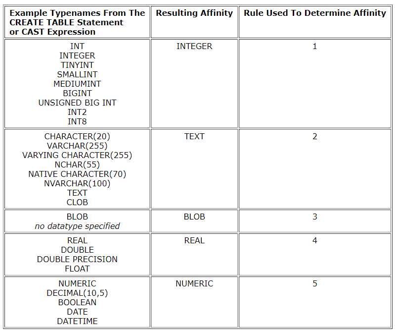

# Database

**몇 개의 자료 파일을 조직적으로 통합**하여 **자료 항목의 중복을 없애**고 **자료를 구조화하여 기억**시켜 놓은 **자료의 집합체**

- 데이터베이스 사용 장점
  - 데이터 중복 최소화
  - 데이터 무결성(정확한 정보를 보장)
  - 데이터 일관성
  - 데이터 독립성(물리적/ 논리적)
  - 데이터 표준화
  - 데이터 보안 유지

## RDB(Relational Database)

키(key)와 값(value)들의 간단한 관계(relation)를 표(table) 형태로 정리한 데이터베이스

관계형 모델에 기반

용어정리

- 스키마(Schema): 데이터베이스 자료의 구조, 표현방법, 관계 등 전반적인 **명세를 기술**한 것
- 테이블(Table): 열(컬럼/필드)과 행(레코드/값)의 모델을 사용해 조직된 데이터 요소들의 집합
- 열(column): 각 열에는 고유한 데이터 형식이 지정됨
- 행(row): 실제 데이터가 저장되는 형태
- 기본키(Primary key): 각 행(레코드)의 고유 값

## RDBMS

Relational Database Management System

관계형 모델을 기반으로 하는 데이터베이스 관리시스템을 의미

- MySQL
- SQLite
- Oracle

SQLite

서버 형태가 아닌 파일 형식 으로 응용 프로그램에 넣어서 사용하는 **비교적 가벼운 데이터베이스**. 구글 안드로이드 운영체제에 기본적으로 탑재된 데이터베이스이며, 임베디도 소프트웨어에도 많이 활용됨. 로컬에서 간단한 DB 구성을 할 수 있으며, 오픈소스 프로젝트 이기 때문에 자유롭게 사용가능

Sqlite Data Type

- NULL: 데이터가 없음을 표시
- INTEGER: 8바이트에 저장된 부호 있는 정수
- REAL: 8바이트 부동 소수점 숫자로 저장된 부동 소수점 값
- TEXT
- BLOB: 입력된 그대로 정확히 저장된 데이터(별다른 타입 없이 그대로 저장)

Sqlite Type Affinity

동적데이터타입, 다른 타입으로 쉽게 변경됨. 타입선호도

SQL(Structured Query Language)

관계형 데이터베이스 관리시스템의 데이터 관리를 위해 특수 목적으로 설계된 프로그래밍 언어

데이터베이스 스키마 생성 및 수정

자료의 검색 및 관리

데이터베이스 객체 접근 조정 관리

분류

|                        분류                         |                             개념                             |                    예시                     |
| :-------------------------------------------------: | :----------------------------------------------------------: | :-----------------------------------------: |
|  DDL - 데이터 정의 언어 (Data Definition Language)  | 관계형 데이터 베이스  구조(테이블, 스키마)를 정의하기 위한 명령어 |         CREATE DROP ALTER         |
| DML - 데이터 조작 언어 (Data Manipulation Language) |    데이터를 저장, 조회, 수정, 삭제 등을 하기 위한 명령어     | INSERT SELECT UPDATE DELETE  |
|   DCL - 데이터 제어 언어 (Data Control Language)    |    데이터베이스 사용자의 권한 제어를 위해 사용하는 명령어    | GRANT REVOKE COMMIT ROLLBACK |

SQL Keywords - DML

- INSERT: 새로운 데이터 삽입(추가)

- SELECT: 저장되어있는 데이터 조회

- UPDATE: 저장되어있는 데이터 갱신

- DELETE: 저장되어있는 데이터 삭제

**CREATE TABLE** 테이블명 (): 테이블 생성

**DROP TABLE** 테이블명: 테이블 삭제

.schema classmates

**INSERT INTO** 테이블명 (컬럼1, 컬럼2, ...) **VALUES** (값1, 값2, ...)

Aggregate Function

집계함수

값 집합에 대한 계산을 수행하고 단일 값을 반환

여러 행으로부터 하나의 결과값을 반환하는 함수

SELECT 구문에서만 사용됨

ex) COUNT(*) : 테이블 전체 행 수를 구함

AVG(age): age 컬럼 전체 평균 값을 구함

MAX

MIN

SUM

LIKE operator

wildcards

%(percent sign) 이자리에 문자열이 있을 수도 없을 수도 있다

_(underscore) 반드시 이자리에 한 개의 문자가 존재해야 한다

2% 2로 시작하는 값

%2 2로 끝나는 값

%2% 2가 들어가는 값

_2% 아무 값이 하나 있고 두번째가 2로 시작하는 값

1___ 1로시작하고 총 4자리인 값

### GROUP BY

행 집합에서 요약 행 집합을 만듦

문장에 WHERE 절이 포함된 경우 반드시 WHERE 절 먼저 작성한다.