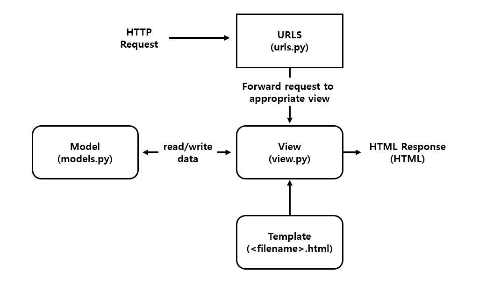

# Django

## Web framework

### Static web page (정적 웹 페이지)

- 추가적인 처리과정 없이 서버에 미리 저장된 파일이 사용자에게 그대로 전달되는 웹 페이지
- 모든 사용자가 동일한 페이지를 받음
- flat page 라고도 함

### Dynamic web page (동적  웹 페이지)

- 웹페이지에 대한 요청을 받은 경우 서버는 추가적인 처리 과정 이후 클라이언트에게 응답을 보냄

- 동적 웹 페이지는 방문자와 상호작용함

- 서버 사이드 프로그래밍 언어(Python, Java, C++ 등)가 사용되며, 파일을 처리하고 데이터베이스와의 상호작용이 이루어짐

  > 서버 사이드 프로그래밍 언어: 백엔드에서 서버 동작을 정의하기 위한 언어. 스크립트 언어 및 마크업 언어를 제외한 대부분의 언어 (HTML, Javascript, CSS 제외)

### Framework

- 프로그래밍에서 특정 운영 체제를 응용 프로그램 표준 구조를 구현하는  클래스와 라이브러리 모임
- 재사용할 수 있는 수많은 코드를 프레임워크로 통합함으로써 개발자가 새로운 애플리케이션을 위한 표준 코드를 다시 작성하지 않아도 같이 사용할 수 있도록 도움
- Application framework라고도 함

### Web Framework

- 웹 페이지를 개발하는 과정에서 겪는 어려움을 줄이는 것을 주 목적으로 데이터베이스 연동, 템플릿 형태의 표준, 세션 관리, 코드 재사용 등의 기능을 포함

### Framework Achitecture

- **MVC Design Pattern**(model - view - controller)

- 사용자 인터페이스로부터 프로그램 로직을 분리하여 애플리케이션의 시각적 요소나 이면에서 실행되는 부분을 서로 영향 없이 쉽게 고칠 수 있는 애플리케이션을 만들 수 있음

- <u>Django는 MTV Pattern이라고 함</u>

  > **MTV Pattern**

  - Model
    - 응용프로그램의 데이터 구조를 정의하고 데이터베이스의 기록을 관리(추가, 수정, 삭제)

  - Template(view)
    - 파일의 구조나 레이아웃을 정의
    - 실제 내용을 보여주는데 사용(presentation)

  - View(controller)
    - HTTP 요청을 수신하고 HTTP 응답을 반환
    - Model을 통해 요청을 충족시키는데 필요한 데이터에 접근
    - template에게 응답의 서식 설정을 맡김

    | MVC Pattern | MTV (Django) |
    | :---------: | :----------: |
    |    Model    |    Model     |
    |    View     |   Template   |
    | Controller  |     View     |

    

    


## 장고 프로젝트 시작

### 1. 가상환경 생성 및 활성화
```bash
$ python -m venv venv 
$ source venv/Scripts/activate
$ pip list
```

- 가상환경 활성화 후 가상환경이 잘 실행되는지 확인하기 위해 `pip list`를 하여 현재 깔려있는 패키지를 확인함

### 2. 장고 설치

```bash
$ pip install django==3.2
$ pip freeze > requirements.txt
```

- 패키지 설치 후 패키지 목록을 저장하기 위해 `pip freeze > requirements.txt` 입력
  (git 으로 관리할 때는 venv는 올리지 않고 requirements.txt만 올려주고, 이후 설치할 때 `pip install -r requirements.txt` 입력)

### 4. 장고 프로젝트 생성

```bash
$ django-admin startproject <프로젝트명> .
```

- 프로젝트명을 `config`로 통일
- 프로젝트명에는 파이썬이나 장고에서 사용중인 키워드는 피해야 하며, `-`도 사용할 수 없음

### 5. 앱 생성

```bash
$ python manage.py startapp <어플리케이션명>
```

- 어플리케이션 이름은 복수형으로 지어야함

### 6. 앱 등록

```python
# <project>/settings.py
INSTALLED_APPS = [
  	# LOCAL APPS
  	'<어플리케이션명>',
  
    # 3rd Party APPS
  	...,
  
    # Django APPS
    ...,
]	
```

- project 내 settings.py에 INSTALLED_APPS 가장 윗줄에 추가해줘야함(*무조건 생성 후 등록!)

### - 서버 활성화

```bash
$ python manage.py runserver
```

### - 새로운 페이지 등록

```python
# <project>/urls.py

from django contrib import admin
from django.urls import path
from <어플리케이션명> import views

urlpatterns = [
    path('admin/', admin.site.urls),
    path('<url 주소>', views.<함수명>),
]
```

- HTTP 요청(request)에 알맞은 View 전달

```python
# <app>/views.py

from django.shortcuts import render

def <함수명>(request):
    return render(request, <페이지명>.html)
```

- HTTP 요청을 수신하고 HTTP 응답을 반환하는 함수 작성
- Model을 통해 요청에 맞는 필요 데이터에 접근
- Template에게 HTTP 응답 서식을 맡김

```html
<!-- <app>/templates/<페이지명>.html -->
...
```

- 실제 내용을 보여주는데 사용되는 파일
- 파일의 구조나 레이아웃을 정의

### - 언어, 시간대 변경

- `settings.py`에 LANGUAGE_CODE를 'ko-kr'
- TIME_ZONE를 'Asia/Seoul'


## Django Template Language(DTL)

- 조건, 반복, 변수 치환, 필터 등의 기능을 제공

### DTL Syntax

- variable(변수)
  - render()를 사용하여 views.py에서 정의한 변수를 template 파일로 넘겨 사용하는 것
  - 변수명은 영어, 숫자와 밑줄_의 조합으로 구성될 수 있으나, 밑줄로는 시작할 수 없음
  - render() 세번째 인자로 {'key': 'value'} 넘겨줌
  - html에 {{ key }} 으로 넣어주면됨
  - key 안에 여러 key를 넣어주고 그 value가 딕셔너리라면, key.value 로 접근한다, 그 value가 리스트라면 key.index로 접근한다
- filter
  - 표시할 변수를 수정할 때 사용
  - 예시
    - {{ name|lower }}
  - [built-in filter reference](https://docs.djangoproject.com/en/4.0/ref/templates/builtins/)
- Tags
  - 출력 텍스트를 만들거나, 반복 또는 논리를 수행하여 제어 흐름을 만드는 등 변수보다 복잡한 일들을 수행
  - 일부 태그는 시작과 종료 태그가 필요
- Comments
  - 한 줄 주석: {# 주석 작성 #}
  - 여러줄 주석: 여기에 주석 작성

### Template inheritance(템플릿 상속)

