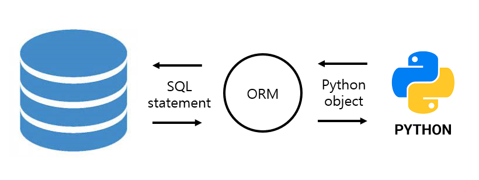

# Django

## Model

저장된 데이터베이스의 구조(layout)를 설계하는 부분이다. Django는 model을 통해 데이터를 접속하고 관리한다. 즉, 모델은 **웹 어플리케이션의 데이터를 구조화하고 조작하기 위한 도구**이다.

- Database : 체계화된 데이터의 모임

- Query : 데이터를 조회하기 위한 명령어, 조건에 맞는 데이터를 추출하거나 조작하는 명령어를 의미한다.

### Database의 기본 구조

- **스키마(Schema)**

  데이터베이스에서 자료의 구조, 표현방법, 관계 등과 관련한 **명세를 기술**한 것이다

  | column  | datatype |
  | ------- | -------- |
  | id      | INT      |
  | title   | TEXT     |
  | content | TEXT     |

- **테이블(Table)**

  **열(컬럼/필드)**과 **행(레코드/값)**의 모델을 사용해 조작된 데이터 요소들의 집합. SQL 데이터베이스에서는 테이블을 관계라고도 한다.

  | id   | name   | age  | gender |
  | ---- | ------ | ---- | ------ |
  | 1    | heewon | 25   | Female |
  | 2    | dongho | 25   | Male   |

  - **열**: 각 열에는 고유한 데이터 형식이 지정된다. (INTEGER, TEXT, NULL)
  - **행**: 테이블의 데이터는 행에 저장된다.
  - **PK(기본키)**: 각 행(레코드)의 고유값으로 Primary Key로 불림. **반드시 설정**해야하며, 데이터베이스 관리 및 관계 설정시 주요하게 활용된다.

## ORM(Object-Relational-Mappting)

객체 지향 프로그래밍 언어(OOP)를 사용하여 **호환되지 않는 유형의 시스템 간에(Django - SQL) 데이터를 변환**하는 프로그래밍 기술이다. Django는 내장 Django ORM을 사용한다. DB를 객체로 조작하기 위해 ORM을 사용한다.



- 장점

  - SQL을 잘 알지 못해도 DB 조작이 가능

  - SQL의 절차적 접근이 아는 객체 지향적 접근으로 인한 높은 생산성


- 단점
  - ORM 만으로 완전한 서비스를 구현하기 어려운 경우가 있다.


​	➡ 현대 웹 프레임워크의 요점은 웹 개발의 속도를 높이는 것(**생산성**)


### models.py 작성

```python
# articles/models.py

class Article(models.Model):
	  title = models.CharField(max_length=10)
  	content = models.TextField()
```

각 모델은 django.models.Model 클래스의 서브 클래스로(상속받음) 표현된다. DB 컬럼을 어떠한 타입으로 정의할 것인지 정한다.

- 모델 필드
  - **CharField(max_length=N, **options)**

    길이의 제한이 문자열을 넣을 때 사용한다. **max_length는 필수 인자**이므로 반드시 작성해야한다.

  - **TextField(**options)**

    글자의 수가 많을 때 사용한다. max_length를 지정해도 의미가 없다.

## Migrations

Django가 모델에 생긴 변화를 반영하는 방법이다. Migrations 실행 및 DB 스키마를 다루기 위한 명령어는 다음과 같다.

- `makemigrations` : 설계도(migration 파일) 제작

- `migrate` : 마이스레이션을 DB에 반영(적용)

- `sqlmigrate`: migrate될 때(반영)의 SQL 구문 확인

- `showmigrations`: 마이그레이션 파일들이 DB에 적용되었는지(migrate 되었는지) 확인

```bash
$ python manage.py makemigrations
$ python manage.py migrate
$ python manage.py sqlmigrate <앱이름> <숫자>
$ python manage.py showmigrations
```

- model 수정

  - 이미 테이블이 생성된 상태에서, 추가 필드를 작성하면 특정 
  - 1-> migration 파일에 적용 -> 장고가 만들어줌
  - 2. models.py에 적용 -> 개발자가 직접 만들어줌

- DateField

  - auto_now_add

    - 최초 생성 일자

    - django ORM이 최초 insert(테이블에 데이터 입력)시에만 현재 날짜와 시간으로 갱신(테이블에 어떤 값을 최초로 넣을 때)

  - auto_now

    - 최종 수정 일자
    - django ORM이 save를 할 때마다 현재 날짜와 시간으로 갱신

## Database API

- DB를 조작하기 위한 도구
- django가 기본적으로 ORM을 제공함에 따른 것으로 DB를 편하게 조작할 수 있도록 도움
- Model을 만들면 django

​	`<class name>.objects.<QuerySet API>`

- Manager

- QuerySet

  - 데이터베이스로부터 전달받은 객체 목록
  - queryset 안의 객체는 0개, 1개 혹은 여러 개일 수 있음

- Django shell

  - 일반 Python shell을 통해서 장고 프로젝트 환경에 접근할 수 없음
  - **장고 프로젝트 설정이 load 된** Python shell을 활용해 DB API 구문 테스트를 진행
  - 기본 Django shell 보다 더 많은 기능을 제공하는 shell_plus를 사용해서 진행
    - Django-extensions 라이브러리 기능 중 하나

  ```bash
  $ pip install ipython
  $ pip install django-extensions
  ```

  ```python
  # settings.py
  INSTALLED_APPS = [
    	# 3rd Party
    	'django-extensions',
  ]
  ```

## CRUD

- READ

  ```shell
  >>> Article.objects.all()
  ```

- CREATE

  ```shell
  # 1
  >>> article = Article()
  >>> article.title = 'title'
  >>> article.content = 'content'
  >>> article.save() 	# 반드시 저장해주어야 함
  >>> article
  
  # 2
  >>>
  
  # 3
  >>> Article.objects.create(title='title', content='content')
  <Article: Article object (3)>
  # 유효성 검사가 되지 않음
  ```

- str method

  - print 할때 출력되는 형태를 지정

  ```python
  class Article(models.Model):
  		....
  		
  		def __str__(self):
  				return 
  ```

- READ

  - QuerySet API method를 사용해 다양한 조회를 하는 것이 중요

  - all()

    - 현재 QuerySet의 복사본을 반환

  - get()

    - 한 개의 데이터만 조회할 때 사용

    - 객체가 없으면 DoesNotExist 예외를 발생시키고,
    - 둘 이상의 객체를 찾으면 MultipleObjectReturned 예외를 발생시킴
    - 대신 get_object_or_404()

  - filter()

    - 주어진 lookup 매개변수와 일치하는 객체를 포함하는 QuerySet을 반환

- UPDATE

  ```shell
  >>> article = Article.objects.get(pk=1)
  >>> article.title = 'new_title'
  >>> article.save
  ```

- DELETE

  ```shell
  >>>
  >>>
  ```

- Filed lookups
  - 조회시 특정 검색 조건을 지정
  - QuerySet 메서드 filter(), exclude(), get()
  - `Article.objects.filter(pk__gt=2)` `=`만 사용할 수 있음 `>`,`<` 사용못함
  - `Article.objects.filter(content__contains='ja')`

## Admin site

```bash
$ python manage.py createsuperuser
```

- admin 등록

  ```python
  # articles/admin.py
  
  from django.contrib import admin
  from .models import Article
  
  # admin site에 register
  admin.site.register(Article)
  ```

- ModelAdmin obtions(custom)

  ```python
  # articles/admin.py
  
  from django.contrib import admin
  from .models import Article
  
  class 
  # admin site에 register
  admin.site.register(Article)
  ```


### 참고자료 

[DJANGO ORM COOKBOOK]