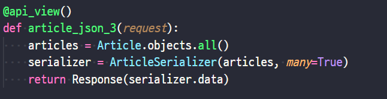
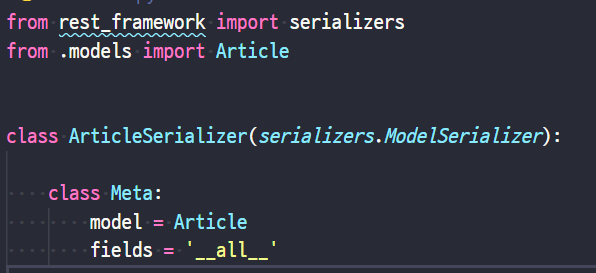

## HTTP

- HyperText Transfer Protocol

#### 특성 

- Stateless
- Connectionless

### HTTP request methods

- 자원에 대한 행위(수행하고자 하는 동작)
- 주어진 리소스에 수행하길 원하는 행동을 나타냄(원하는 자원이 무엇이냐~)
- 예시
  - GET(조회), POST(작성), PUT(수정), DELETE(삭제)

### HTTP response status codes

특정 HTTP 요청이 성공적으로 완료되었는지 여부를 나타냄

- Informational responses(1xx)
- Successful responses(2xx)
- Redirection messages(3xx)
- Client error responses(4xx)
- Server error responses(5xx)

### 리소스 식별

- HTTP 요청의 대상을 리소스(resource, 자원)라고 함
- 리소스는 문서, 사진 또는 기타 어떤 것이든 될 수 있음
- 각 리소스는 리소스 식별을 위해 HTTP 전체에 사용되는 URI(Uniform Resource Identifier)로 식별됨

### URL(Uniform Resource Locator)

- 통합 자원 위치
- 네트워크 상에 자원이 어디 있는지 알려주기 위한 약속
- `웹 주소`, `링크` 라고도 불림

### URN(Uniform Resource Name)

- 통합 자원 이름
- URL과 달리 자원의 위치에 영향을 받지 않는 유일한 이름 역할을 함

### URI(Uniform Resource Identifier)

- 통합 자원 식별자
- 인터넷의 자원을 식별하는 유일한 주소(정보의 자원을 표현)
- 인터넷에서 자원을 식별하거나 이름을 지정하는데 사용되는 간단한 문자열
- URI는 URL과 ,URN으로 나눌 수 있지만, URN을 사용하는 비중이 매우 작기 때문에 일반적으로 URL은 URI와 같은 의미로 사용하기도 함

### 구조

- Scheme(protocol)
  - 브라우저가 사용해야하는 프로토콜
  - http(s), data, file, ftp, malito
  - `https://`

- Host(Domain name)
  - 요청을 받는 웹 서버의 이름
  - IP address를 직접 사용할 수도 있지만, 실 사용시 불편하므로 웹에서 그리 사용되지 않음
  - `www.example.com`
- Port
  - 웹 서버 상의 리소스를 접근하는데 사용되는 기술적인 문
  - 개발할 때 사용
  - HTTP 프로토콜의 표준 포트
    - HTTP 80
    - HTTPS 443
  - `:80`
- Path
  - 웹 서버 상의 리소스 경로
  - 초기에는 실제 파일이 위치한 물리적 위치를 나타냈지만, 오늘날은 물리적인 실제 위치가 아닌 추상화 형태의 구조로 표현
  - `/path/to/myfile.html`
- Query(Identifier)
  - Query String Parameters
  - 웹 서버에 제공되는 추가적인 매개 변수
  - `&`로 구분되는 key-value 목록
  - `?key=value`
- Fragment
  - Anchor
  - 자원 안에서의 북마크의 한 종류를 나타냄
  - 브라우저에게 해당 문서(HTML)의 특정 부분을 보여주기 위한 방법
  - 브라우저에게 알려주는 요소이기 때문에 fragment identifier(부분 식별자)라고 부르며 **'#' 뒤의 부분은 요청이 서버에 보내지지 않음**
  - document에서 많이 볼 수 있음!!
  - `#quick-start`

## RESTful API

### API

- application programming Interface
- 프로그래밍 언어가 제공하는 기능을 수행할 수 있게 만든 인터페이스
  - 애플리케이션과 프로그래밍으로 소통하는 방법
  - CLI는 명령줄, GUI는 그래픽(아이콘), API는 프로그래밍을 통해 특정 기능 수행
- Web API
  - 웹 어플리케이션 개발에서 다른 서비스에 요청을 보내고 응답을 받기 위해 정의된 명세
  - 현재 웹 개발은 모든 것을 직접 개발하기보다 여러 Open API를 활용하는 추세
- 응답 데이터 타입
  - HTML, XML, JSON 등

### REST

- REpresentational State Transfer
- API Server를 개발하기 위한 일종의 소프트웨어 설계 방법론(규약이나 약속이 아님)
  - 2000년 로이 필딩의 박사학위 논문에서 처음으로 소개된 후 네트워킹 문화에 널리 퍼짐
- 네트워크 구조(Network Architecture) 원리의 모음
  - 자원을 정의하고 자원에 대한 주소를 지정하는 전반적인 방법
- REST 원리를 따르는 시스템을 RESTful 이란 용어로 지칭함
- 자원을 정의하는 방법에 대한 고민

#### REST의 자원과 주소의 지정 방법

1. 자원

   URI

2. 행위

   HTTP Method

3. 표현

   - 자원과 행위를 통해 궁극적으로 표현되는 (추상화된) 결과물
   - **JSON**으로 표현된 데이터를 제공

### JSON(JavaScript Object Notation)

- lightweight data-interchange formate
- JavaScript의 표기법을 따른 단순 문자열

#### 특징

- 사람이 읽거나 쓰기 쉽고 기계가 파싱(해석, 분석)하고 만들어내기 쉬움
- 파이썬의 dictionary, 자바스크립트의 object처럼 C 계열의 언어가 갖고 있는 자료구조로 쉽게 변화할 수 있는 **key-value** 형태의 구조를 갖고 있음

### REST의 핵심 규칙

1. 정보는 URI로 표현
2. 자원에 대한 행위는 HTTP Method로 표현(GET, POST, PUT, DELETE)

- 설계 방법론은 지키지 않았을 대 잃는 것보다 지켰을 대 얻는 것이 훨씬 많음
  - 지키지 않더라도 동작 여부에 큰 영향을 미치지 않음

### RESTful API

- REST 원리를 따라 설계한 API

- RESTful services, 혹은 simply REST services라고도 부름

- 프로그래밍을 통해 클라이언트 요청에 **JSON을 응답하는 서버**를 구성

## Response

### Init Project

- 가상환경 및 패키지(requirements.txt) 설치

### Create Dummy Data

python manage.py seed articles --number=20

JsonResponse

Content-Type entity header

JsonResponse objects

JSON-encoded response를 만드는 HttpResponse의 서브 클래스

'safe'parameter

- True
- dict 이외의 객체를 직렬화(Serialization)

Serialization

- 직렬화
- 데이커 구조나 객체 상태를 동일하거나 다른 컴퓨터 환경에 저장하고, 나중에 재구성할 수 있는 포맷으로 변환하는 과정
- Serializer in django
  - QuerySet 및 Model Instance

### Response - django Serializer

- django의 내장 HttpResponse를 활용한 JSON 응답 객체
- 

Response - Django REST Framework

- Django REST framework(DRF) 라이브러리를 사용한 JSON 응답
- 설치 후 등록
  - `pip install djangorestframework`
  - settings.py `INSTALLED_APPS`에 `rest_framework` 등록

- serializer.py

  

DRF with single Model

- 단일 모델의 data를 직렬화(serialization)하여 JSON으로 변환하는 방법에 대한 학습

- 단일 모델을 두고 CRUD 로직을 수행 가능하도록 설계

- API 개발을 위한 핵심 기능을 제공하는 도구 활용
  - DRF built-in form

