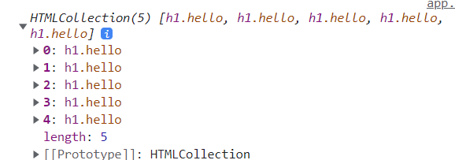

# JavaScript

## Document에서 요소 선택


- 브라우저가 불러온 웹 페이지를 나타낸다.

- html에서 작성된 부분을 자바스크립트에서 받아서 사용할 수 있다.

```javascript
document.title = "Hi";
console.log(document.body);
```


### id로 요소 찾기

`document.getElementById(id)` : 주어진 문자열과 일치하는 id 속성을 가진 요소를 찾고, 이를 나타내는 element 객체를 반환한다.

```javascript
const title = document.getElementById("title"); // title이라는 id를 가진 요소를 찾아서 반환
title.innerText = "Hello!";
```


### class 이름으로 요소 찾기

`document.getElementsByClassName(classname)`: 주어진 클래스 이름을 모두 가진 모든 자식 요소의 배열과 유사한 개체를 반환

```javascript
const Hellos = document.getElementsByClassName("hello"); // class 이름이 hello인 모든 요소를 반환한다.
```




### 선택자로 요소 찾기

`document.querySelector()`: 주어진 조건(태그, id, class)와 일치하는 첫번째 선택자를 반환한다.

```javascript
const title = document.querySelector(".hello"); // class name이 hello 요소를 반환한다.
```


## Event 처리

`EventTarget.addEventListener(type, listener)`: 이벤트 타겟에 특정 이벤트가 발생할 때마다 listener를 실행시킨다. EventTarget은 주로 element, document, window이지만, event가 지원되는 모든 객체가 될 수 있다.

```javascript
const title = document.querySelector(".hello");

function handleTitleClick(){
  title.style.color = "blue";
}

function handleMouseEnter(){
  title.innerText = "mouse is here.";
}

function handleMouseLeave(){
  title.innerText = "mouse is gone.";
}

title.addEventListener("click", handleTitleClick); // 클릭이라는 이벤트가 실행됐을 때, handleTitleClick이라는 함수가 실행된다
title.addEventListener("mouseenter", handleMouseEnter); // 마우스를 해당 객체 위에 뒀을 경우 handleMouseEnter 함수가 실행된다
title.addEventListener("mouseleave", handleMouseLeave); // 마우스를 해당 객체를 벗어나서 뒀을 경우 handleMouseLeave 함수가 실행된다


function handleWindowResize(){
  document.body.style.backgroundColor = "yellow"; // title, body 와 같은 특정 태그만 document.body로 접근할 수 있음
}

function handleWindowCopy(){
  alert("copier!");
}

function handleWindowOffline(){
  alert("no WIFI");
}

function handleWindowOnline(){
  alert("all good");
}

window.addEventListener("resize", handleWindowResize); // 창 크기를 변환시키려고 했을 때 실행됨
window.addEventListener("copy", handleWindowCopy); // 복사하려고 했을 때 실행됨
window.addEventListener("offline", handleWindowOffline); // 와이파이가 해제되었을 때 실행됨
window.addEventListener("online", handleWindowOnline); // 와이파이가 연결되었을 때 실행됨

```


- 제목을 클릭했을 때, 현재 글자색이 파란색이면 빨간색으로, 빨간색이면 파란색으로 바꾸기

  ```javascript
  const h1 = document.querySelector("h1");
  
  function handleTitleClick(){
    const currentColor = h1.style.color;  // 현재 글자색
    let newColor;													// 바뀔 글자색
    if (currentColor === "blue"){ 
      newColor = "red";
    } else {
      newColor = "blue";
    }
    h1.style.color = newColor;
  }
  
  title.addEventListener("click", handleTitleClick); // title을 클릭했을 때 handleTitleClick 함수 실행
  ```

  

- h1 태그를 클릭했을 때, 해당 태그가 'active'라는 클래스가 있다면 지우고, 없다면 active 클래스를 추가하기

  ```javascript
  const h1 = document.querySelector("h1");
  
  function handleTitleClick() {
    const clickedClass = "active";
    if (h1.classList.contains(clickedClass)) {
      h1.classList.remove(clickedClass);
    } else {
      h1.classList.add(clickedClass);
    }
  }
  
  // 위의 함수와 동일한 기능을 수행한다.
  //function handleTitleClick() {
  //  h1.classList.toggle("active"); // 클래스가 있다면 지우고 없으면 포함시킨다
  //}
  
  h1.addEventListener("click", handleTitleClick);
  
  
  ```

  