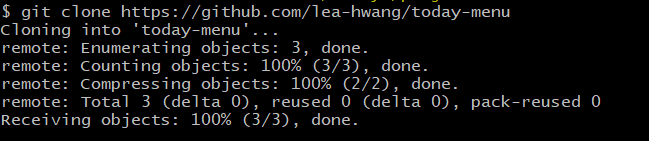
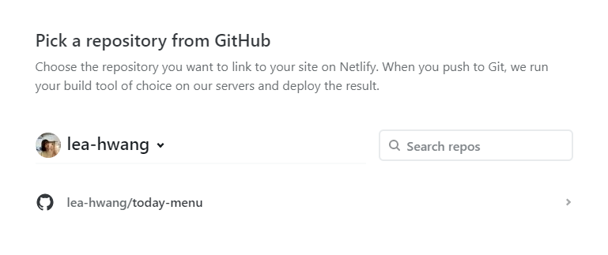
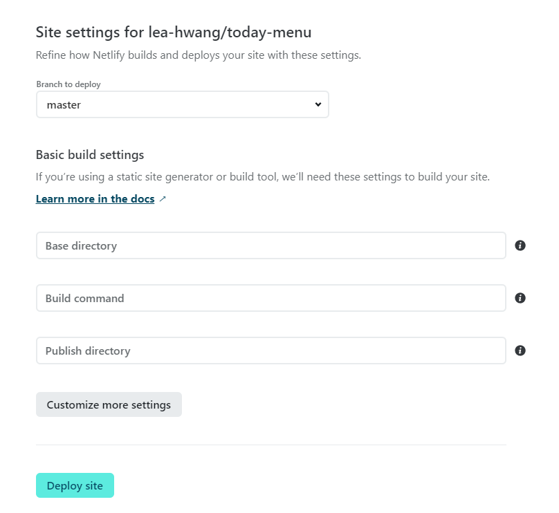

# github과 netlify를 이용한 https 호스팅

1. github에 프로젝트 푸쉬 or git clone 하고 푸시해도 됨.

   

2. netlify에 해당 프로젝트 호스팅

   - netlify 회원가입

   - import an existing project(import from git)

   - github 선택

     - limit github access to public repositories. 원한다면 선택

       

   - 승인 요청(Authorize netlify 선택)

   - only select repositories -> 원하는 프로젝트 레포지토리 선택

   - install 버튼

   - 비밀번호 입력

   - 레포지토리 선택

   

   - build command 는 따로 없기 때문에 생략. 따로 설정할 값이 없기 때문에 Deploy site

     

3. 배포 후 설정

   - 도메인 설정에 들어가서 change site name으로 변경

​				

4. API_KEY 저장
   - environment/ environment varibles 에서 API_KEY 등록

참고 사이트

https://heropy.blog/2018/01/10/netlify/

