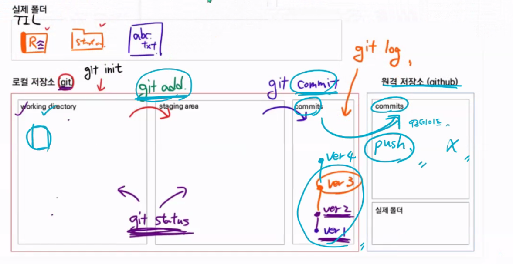

# Git

## 기본적인 구조

- 로컬 저장소(git)

  - working directory : 현재 작업 공간

  - staging area: 수정된 코드를 올리는 공간

  - local repository: 버전 관리를 하고 있는 공간(최종본 올리기)

- 원격 저장소(github)
  - remote repository: 원격 저장소

- untracked : staging area에 올라가 있지 않은 파일 및 폴더

- tracked : staging area에 이미 올라간 적이 있는 파일 및 폴더

### 명령어

#### 1. 현재 폴더 git 생성

`git init`:해당 폴더를 git으로 관리 시작, repository 생성

#### 2. 현재 폴더의 상태 파악

`git status`: 현재 working directory 및 staging area의 상태

#### 3. 사용자 정보 등록

`git config --global user.email {이메일}` : 이메일 등록

`git config --global user.name {이름}` : 이름 등록

#### 4. staging area에 파일 및 폴더 옮기기

`git add {파일 및 폴더명}` : working directory에서 staging area로 올리기

`git add .` : 현재 working directory의 모든 파일을 올리기

#### 5. local repository에 파일 및 폴더 옮기기

`git commit`: staging area에서 local repository로 올리기

`git commit -m '{메세지 내용}'`: 메모를 작성할 수 있음

#### 6. 현재 local repository에 commit된 내용 보기

`git log`: commit한 내용을 보여줌

#### 7. 원격 저장소 정보 등록

`git remote add origin {url}`: 원격 저장소 추가

* origin -> 주소의 이름(별명) ex)우리집, 본가

#### 8. 로컬 내용 원격 저장소에 올리기

`git push origin master`: 원격 저장소에 commit

`git push -u origin master`: 원격 저장소에 commit 된 내용 올리기

#### 9. 현재 등록된 원격저장소 보기

`git remote -v`: 현재 저장된 원격저장소 보기

 