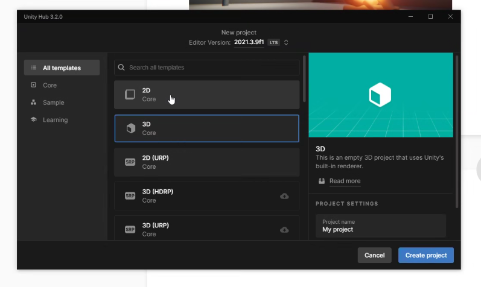

## real-time 엔진

애니메이션, 디자인 또는 그래픽과 같은 시각화를 즉시 생성할 수 있게 해주는 도구

- 제품 제작 전 디자인 오류를 줄이기 위해 실시간 렌더링이 중요

- 몰입형 기술로 제품 디자인을 경험해보는 것이 중요

게임/디자인/제조/건축 등 굉장히 다양한 산업분야에 접목됨

EX) 아우디 디지털 쇼룸 / 할리우드 VR 체험 / 아키텍처 렌더링

offline rendering image - 8시간

realtime-rendering image - 0.1 초

realtime engine에는 두 가지가 있음

- unreal engine

- unity engine

| -                      | Unreal Engine                         | Unity                        |
| ---------------------- | ------------------------------------- | ---------------------------- |
| 개요                     | 실감있는 RealTime 3D 개발 환경을 제공하는 통합형 게임엔진 | 전세계에서 가장 널리 사용되는 RT3D 개발 플랫폼 |
| 개발 언어                  | C++ containers and blueprints         | C# base                      |
| 마켓플레이스                 | unreal은 마켓이 굉장히 작음                    | unity가 더 저렴하고 더 많은 캐릭터/환경    |
| 기본기능(재질, reflection 등) | 설정하기 좀 어려움                            | 굉장히 단순                       |
| 품질                     | 품질이 굉장히 좋음                            | unreal를 많이 따라잡으려             |
| 난이도                    | 상                                     | 중                            |

ML-Agent - unity 안에서 머신러닝을 통해 학습을 시킬 수 있음

UnityHub - 유니티 버전을 관리할 수 있는 프로그램

팀원들끼리 유니티 버전을 **반드시** 통일해야 함(2021.3.9f1)

