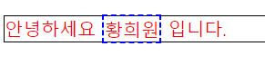

# Web

## HTML

> Hyper Text Markup Language

- `Hyper Text`: 참조(하이퍼링크)를 통해 사용자가 한 문서에서 다른 문서로 즉시 접근할 수 있는 텍스트

- `Markup Language`: 태그 등을 이용하여 문서나 데이터의 구조를 명시하는 언어
  - 대표적인 예 - `HTML`, `Markdown`

-> **웹 페이지를 작성(구조화)하기 위한 언어**

- 현재 웹 표준
  - W3C(HTML5), WHATWG(HTML Living Standard)
  - 현재는 WHATWG 가 좀 더 주도적

### HTML 기본구조

- `html`: 문서의 최상위(root) 요소

- `head`: 문서 메타데이터 요소(html 정보)

  - 문서 제목, 인코딩, 스타일, 외부 파일 로딩 등
  - 일반적으로 브라우저에 나타나지 않는 내용

- `body`: 문서 본문 요소

  - **실제 화면 구성**과 관련된 내용

  ```html
  <!DOCTYPE html> -> 해당 문서가 html5로 구성되어 있음(구버젼 브라우져를 위해 작성)
  <html lang="ko"> -> 기본값 en
  <head>
    <meta charset="UTF-8">
    <title>Document</title>
  </head>
  <body>
      
  </body>
  </html>
  ```

- head 예시

  - `<title> ` : 브라우저 상단 타이틀

  - `<meta>` : 문서 레벨 메타데이터 요소(보통 `charset` 속성을 이용하여 enconding 값 넣음)

  - `<link>` : 외부 리소스 연결 요소(**CSS** 파일, favicon, bootstrap cdn 등)

  - `<script>` : 스크립트 요소(**JavaScript** 파일/코드)

  - `<style>` : `CSS` 직접 작성

    ```html
    <head>
      <title> HTML 수업</title>
      <meta charset="UTF-8">
      <link href="style.css" rel="stylesheet">
      <script src="javascript.js"></script>
      <style>
        p {
          color: black;
        }
      </style>
    </head>
    ```

- Open Graph Protocol

  > 메타 데이터를 표현하는 새로운 규약

  - HTML 문서의 메타 데이터를 통해 문서의 정보를 전달

  - 메타정보에 해당하는 제목, 설명 등을 쓸 수 있도록 정의

  - 예시

    

    > 출처 https://blog.ab180.co/posts/open-graph-as-a-website-preview

- DOM(Document Object Model) 트리

  > 텍스트 파일 HTML 문서를 브라우저에서 렌더링 하기 위한 구조

  - HTML 문서에 대한 모델을 구성함

  - HTML 문서 내의 각 요소에 접근 / 수정에 필요한 프로퍼티와 메서드를 제공함

    ```html
    <body>
      <h1>웹문서</h1>
      <ul>
        <li>HTML</li>
        <li>CSS</li>
      </ul>
    </body>
    ```

- **요소**(`element`)

  > HTML 요소는 **시작 태그**와 **종료 태그** 그리고 태그 사이에 위치한 **내용**으로 구성

  `<h1>contents</h1>`

  - 태그(Element, 요소)는 컨텐츠(내용)를 감싸는 것으로 그 정보의 성격과 의미를 정의

  - 내용이 없는 태그들
    - `br`, `hr`, `img`, `input`, `link`, `meta`
  - 요소는 중첩(nested)될 수 있음
    - 요소의 중접을 통해 하나의 문서를 구조화
    - 여는 태그와 닫는 태그의 쌍을 잘 확인해야함
      - **오류를 반환하는 것이 아닌** 그냥 레이아웃이 깨진 상태로 출력되기 때문에, 디버깅이 힘들어질 수 있음

- **속성**(`attribute`)

  > 속성명="속성값"
  >
  > 공백 X, 쌍따옴표 사용
  >
  > Tag 별로 사용가능한 속성은 다르다

  `<a href="https://google.com"></a>`

  - 속성을 통해 **태그의 부가적인 정보**를 설정할 수 있음
  - 요소는 속성을 가질 수 있으며, 경로나 크기와 같은 추가적인 정보를 제공
  - 요소의 시작 태그에 작성하며 보통 이름과 값이 하나의 쌍으로 존재
  - 태그와 상관없이 사용가능한 속성(`HTML Global Attribute`)들도 있음

- `HTML Global Attribute`

  > 모든 HTML 요소가 공통으로 사용할 수 있는 대표적인 속성

  - `id`: 문서 전체에서 **유일한 고유 식별자** 지정
  - `class`: 공백으로 구분된 해당 요소의 클래스의 목록
  - `data-*`: 페이지에 개인 **사용자 정의 데이터 저장**하기 위해 사용
  - `style`: inline 스타일, 해당 요소를 꾸밀 때 사용
  - `title`: 요소에 대한 **추가 정보 지정**
  - `tabindex`: 요소의 **탭 순서**

- **시맨틱 태그**

  - HTML5에서 **의미론적 요소**를 담은 태그의 등장

    - 기존 영역을 의미하는 `div` 태그를 대체하여 사용

  - 대표적인 태그 목록

    - `header`: 문서 전체나 섹션의 헤더(**머리말 부분**)

    - `nav`: **내비게이션**

    - `aside`: **사이드**에 위치한 공간, 메인 콘텐츠와 관련성이 적은 콘텐츠

    - `section`: 문서의 일반적인 구분, **컨텐츠의 그룹**을 표현

    - `article`: 문서, 페이지, 사이트 안에서 **독립적으로 구분**되는 영역

    - `footer`: 문서 전체나 섹션의 푸터(**마지막** 부분)

      ```html
      <header>
        <nav></nav>
      </header>
      <section>
        <article></article>
        <article></article>
      </section>
      <footer></footer>
      ```
  
  - Non semantic 요소는 `div`, `span` 등이 있으며 `h1`, `table`, `img`, `form` 태그들도 시맨틱 태그로 볼 수 있음
  - 개발자 및 사용자 뿐만 아니라 검색엔진 등에 의미 있는 정보의 그룹을 태그로 표현
  - 단순히 **구역을 나누는** 것 뿐만 아니라 **'의미'를 가지는** 태그들을 활용하기 위한 노력
  - 요소의 의미가 명확해지기 때문에 코드의 가독성을 높이고 유지보수를 쉽게 함
  - 검색엔진최적화(SEO)를 위해서 메타태그, 시맨틱 태그 등을 통한 마크업을 효과적으로 활용 해야함

### HTML 문서 구조화

- 인라인 / 블록 요소
  - 인라인 : 현재 혹은 자식 요소의 가로를 차지
  - 블록 : 부모 요소의 가로 전체를 차지

- 텍스트 요소

| 태그                             | 설명                                                         |
| -------------------------------- | ------------------------------------------------------------ |
| `<a></a>`                        | `href` 속성을 활용하여 다른 URL로 연결하는 하이퍼링크 생성   |
| `<b></b>`<br>`<strong></strong>` | 굵은 글씨 요소<br>중요한 강조하고자 하는 요소(보통 굵은 글씨로 표현) |
| `<i></i>`<br>`<em></em>`         | 기울임 글씨 요소<br>중요한 강조하고자 하는 요소(보통 기울임 글씨로 표현) |
| `<br>`                           | 텍스트 내에 줄 바꿈 생성                                     |
| ``                          | `src` 속성을 활용하여 이미지 표현                            |
| `<span></span>`                  | 의미 없는 **인라인** 컨테이너                                |

> `<strong>`, `<em>`은 **시맨틱태그**로, 강조하고자 하는 요소를 표현함

- 그룹 컨텐츠

  | 태그                        | 설명                                                         |
  | --------------------------- | ------------------------------------------------------------ |
  | `<p></p>`                   | 하나의 문단(paragraph)                                       |
  | `<hr>`                      | 문단 레벨 요소에서의 주제의 분리를 의미하며 수평선으로 표현됨(A Horizontal Rule) |
  | `<ol></ol>`<br>`<ul></ul>`  | 순서가 있는 리스트(ordered)<br>순서가 없는 리스트(unordered) |
  | `<pre></pre>`               | HTML에 작성한 내용을 그대로 표현 <br>보통 **고정폭 글꼴**이 사용되고 공백문자를 유지 |
  | `<blockquote></blockquote>` | 텍스트가 긴 인용문<br>주로 **들여쓰기** 한 것으로 표현됨     |
  | `<div></div>`               | 의미 없는 **블록** 레벨 컨테이너                             |

- `table`

  - table의 각 영역을 명시하기 위해 `<thead>` `<tbody>` `<tfoot>` 요소를 활용

  - `<tr>`: 가로줄

  - `<th>`: thead 부분의 각각의 칸

  - `<td> `: tbody 부분의 각각의 칸

  - `colspan`(가로로 병합), `rowspan`(세로로 병합) 속성을 활용해서 셀 병합

  - `<caption>`을 통해 표 설명 또는 제목을 나타냄

    ```html
    <body>
      <table>
        <thead>
          <tr>
            <th>ID</th>
            <th>Name</th>
            <th>Major</th>
          </tr>
        </thead>
        <tbody>
          <tr>
            <td>1</td>
            <td>황희원</td>
            <td>Finance</td>
          </tr>
          <tr>
            <td>2</td>
            <td>홍길동</td>
            <td>Business</td>
          </tr>
        </tbody>
        <tfoot>
          <tr>
            <td>총계</td>
            <td colspan="2">2명</td>
          </tr>
        </tfoot>
        <caption>1반 학생 명단</caption>
      </table>
    </body>
    ```

- `form`

  - `<form>`은 **정보(데이터)를 서버에 제출**하기 위한 영역
  - `<form>` 기본 속성
    - `action`: form을 처리할 **서버의 URL**
    - `method`: form을 제출할 때 사용할 **HTTP 메서드** (`GET` 혹은 `POST`)
    - `enctype`: method가 **post**인 경우 데이터의 유형
      - `application/x-www-form-urlencoded`: 기본값
      - `multipart/form-data` : 파일 전송시 (input type이 file인 경우 (주로 **이미지, 비디오, 파일**))
      - `text/plain`: HTML 5 디버깅 용(잘 사용되지 않음)

- `input`

  - 다양한 타입을 가지는 입력 데이터 유형과 위젯이 제공됨

  - `<input>` 대표적인 속성

    - `name`: form control에 적용되는 이름(이름/값 페어로 전송됨)

    - `value`: form control에 적용되는 값(이름/값 페어로 전송됨)

    - `required`, `readonly`, `autofocus`, `autocomplete`, `disabled` 등

      -> 단일 속성(속성명만 있어도 자동으로 속성이 적용, 속성값이 없어도 됨)

  - input label

    - **label을 클릭**하여 input 자체의 초점을 맞추거나 활성화 시킬 수 있음
      - 사용자는 선택할 수 있는 영역이 늘어나 웹 / 모바일(터치) 환경에서 편하게 사용할 수 있음
      - label과 input 입력의 관계가 시각적 뿐만 아니라 화면리더기에서도 label을 읽어 쉽게 내용을 확인할 수 있도록 함
      - `<input>`에 **id 속성**을, `<label>`에는 **for 속성**을 활용하여 상호 연관을 시킴

  - 유형(일반)

    > 일반적으로 입력을 받기 위하여 제공되며 타입별로 HTML 기본 검증 혹은 추가 속성을 활용할 수 있음
  
    - `text`: 일반 **텍스트** 입력
    - `password`: 입력 시 **값이 보이지 않고** 문자를 특수기호(*)로 표현
    - `email`: 이메일 형식이 아닌 경우 form 제출 불가
    - `number`: `min`, `max`, `step` 속성을 활용하여 숫자 범위 설정 가능
    - `file`: `accept` 속성을 활용하여 **파일 타입 지정** 가능
  
  - 유형(항목 중 선택)
  
    - 일반적으로 `label`을 사용하여 내용을 작성하여 항목 중 선택할 수 있는 `input`을 제공
    - **동일 항목에 대하여는 동일한 `name`을 지정하고 선택한 항목에 대한 `value`를 지정해야 함**
      - `checkbox` : 다중 선택
      - `radio` :  단일 선택
  
  - 유형(기타)
  
    - 다양한 종류의 `input`을 위한 `picker`를 제공
      - `color`: color picker
      - `date`: date picker
    - `hidden input`을 활용하여 사용자의 입력을 받지 않고 서버에 전송되어야 하는 값을 설정
      - `hidden`: 사용자에게 보이지 않는 `input`

## CSS

> Cascading Style Sheets
>
> 스타일을 지정하기 위한 언어

- 선택자(Selector)

  > 명칭 꼭 기억해두기

  ```css
  h1 {
    color: blue;
    font-size: 15px;
  }
  h1-> 선택자(Selector)
  color: blue; 선언
  color, font-size -> 속성
  blue, 15px -> 값
  h1 뒤에 꼭 한칸 띄우기
  ; 세미콜론으로 무조건 끝내기
  ```

  - CSS 구문은 선택자를 통해 스타일을 지정할 HTML 요소를 선택
  - 중괄호 안에서는 속성과 값, 하나의 쌍으로 이루어진 선언을 진행
  - 각 쌍은 선택한 요소의 속성, 속성에 부여할 값을 의미
    - 속성(Property) : 어떤 스타일 기능을 변경할지 결정
    - 값(Value): 어떻게 스타일 기능을 변경할지 결정

- CSS 정의 방법

  - **인라인(inline)** : 요소의 속성 중 `style`을 이용

  - **내부 참조(embedding)**: `<head>`태그 내에 `<style>`에 지정

  - **외부 참조(link file)**: 분리된 CSS 파일(`.css`)을 `<head>`내 `<link>`를 통해 불러오기

  - 예시

    ```html
    <!DOCTYPE html>
    <html>
    	<head>
      	<meta charset="UTF-8">
        <title>Document</title>
      	<style>
          h2 {
            color: red;
          }
        </style>
        <link href="ex.css" rel="stylesheet">
    	</head>
      <body>
        <!-- 인라인 -->
        <h1 style="color: blue;">Hello</h1>
        <!-- 내부 참조 -->
        <h2>Hello</h2>
        <!-- 외부 참조 -->
        <h3>my name is heewon</h3>
      </body>
    </html>
    ```

    ```css
    /* 외부 참조 */
    h3 {
      color: green;
    }
    ```


## CSS Selectors

- 선택자 유형

  - **기본 선택자**

    - **전체 선택자**(`*`), **요소 선택자**(해당 선택자)

      > 여러 요소를 선택하고 싶을 때는 콤마(`,`) 이용

      ```css
      /* 전체 선택자*/
      * {
        color: red;
      }
      
      /* 요소 선택자 */
      /* HTML 태그를 직접 선택 */
      h2 {
        color: orange;
      }
      
      /* 여러 개 선택*/
      h3, h4 {
        font-size: 10px;
      }
      ```

    - **클래스 선택자**(`.classname`), **아이디 선택자**(`#idname`), 속성 선택자

      ```css
      /* 클래스 선택자 */
      /* 마침표(.) 문자로 시작하며, 해당 클래스가 적용된 항목을 선택 */
      .green {
        color: green;
      }
      /* 아이디 선택자 */
      /* #문자로 시작하며, 해당 아이디가 적용된 항목을 선택 */
      /* 일반적으로 하나의 문서에 1번만 사용. 여러번 사용해도 동자하지만, 단일 id를 사용하는 것을 권장 */
      #purple {
        color: purple;
      }
      /* 속성 선택자 */
      [title="first h2"] {
        background: black; 
        color: yellow;
      }
      ```

- 우선 순위(cascading order)

  1. 중요도(Importance) - 사용시 주의
     - `!important`
     
  2. 우선 순위
     - 인라인(`style=""`) > id(`#`) > class(`.`), 속성, pseudo-class > 요소, pseudo-element > 전체
     
  3. CSS 파일 로딩 순서
     - 가장 마지막에 적힌 것이 우선순위가 높다.
     
     -> !importannt > 인라인 > class, 속성 > 요소 > 소스 순서

  ```css
  <head>
    <style>
      h2 {
        color: darkviolet !important;
      }
  
      p {
        color: orange;
      }
      
      .blue {
        color: blue;
      }
  
      .green {
        color: green;
      }
  
      #red {
        color: red;
      }
    </style>
  </head>
  <body>
    <p>1</p> <!--orange-->
    <p class="blue">2</p> <!--blue-->
    <p class="blue green">3</p> <!--green-->
    <p class="green blue">4</p> <!--green-->
    <p id="red" class="blue">5</p> <!--red-->
    <h2 id="red" class="blue">6</h2> <!--darkviolet-->
    <p id="red" class="blue" style="color:black">7</p> <!--black-->
    <h2 id="red" class="blue" style="color:yellow">8</h2> <!--darkviolet-->
  </body>
  ```

- 상속

  > 상속을 통해 부모 요소의 속성을 자식에게 상속한다.

  - 상속가능 : **Text 관련 요소**(`font`, `color`, `text-align`), `opacity`, `visibility` 등

  - 상속 불가능 : **Box model** 관련 요소(`width`, `height`, `margin`, `padding`, `border`, `box-sizing`, `display`), **Position** 관련 요소(`position`, `top/right/bottom/left`, `z-index`) 등 상속 불가능

    ```css
    <style>
      p {
        /* 상속됨 */
        color: red;
        /* 상속 안됨 */
        border: 1px solid black;
      }
      span {
        border: 2px dashed blue;
      }
    </style>
    <body>
      <p>안녕하세요 <span>황희원</span> 입니다.</p>
    </body>
    ```
    
    


### CSS 기본 스타일

- 크기 단위

  - `px`(픽셀)

    - 모니터 해상도의 한 화소인 픽셀 기준
    - 픽셀의 크기는 변하지 않기 때문에 **고정적**인 단위

  - `%`

    - **백분율** 단위
    - 가변적인 레이아웃에서 자주 사용

  - `em`

    - (바로 위, 부모 요소에 대한) **상속의 영향을 받음**
    - 배수 단위, 요소에 지정된 사이즈에 상대적인 사이즈를 가짐

  - `rem`

    - (바로 위 부모 요소에 대한) **상속의 영향을 받지 않음**

    - 최상위 요소(html)의 사이즈를 기준으로 배수 단위를 가짐

      ```html
      <style>
        .em {
          font-size: 1.5em;
        }
        .rem {
          font-size: 1.5rem;
        }
      </style>
      <body>
      	<ul class="em">
      		<li class="em">1.5em</li>
      		<li class="rem">1.5rem</li>
      		<li>no class</li>
      	</ul>
      </body>
      ```
      

  

  - `viewport`
    - 웹 페이지를 방문한 유저에게 바로 보이게 되는 <u>웹 컨텐츠의 영역(디바이스 화면)</u>
    - 디바이스의 viewport를 기준으로 상대적인 사이즈가 결정됨
    - `vw`, `vh`, `vmin`, `vmax`

- 색상 단위

  - 색상 키워드
    - **대소문자를 구분하지 않음**
    - `red`, `blue`, `black`과 같은 특정 색을 직접 글자로 나타냄
    
  - RGB 색상
    - 16진수 표기법 혹은 함수형 표기법을 사용해서 특정 색을 표현하는 방식
      - `#` + 16진수 표기법
      - `rgb()` 함수형 표기법
    
  - HSL 색상
    - 색상, 채도, 명도를 통해 특정 색을 표현하는 방식
    
    ```css
    p { color: black;}
    p { color: #000;}
    p { color: #000000;}
    p { color: rgb(0, 0, 0);}
    p { color: hsl(120, 100%, 0);}
    
    p { color: rgba(0, 0, 0, 0.5);}
    p { color: hsla(120, 100%, 0.5);}
    ```

- 문서 표현

  - 텍스트
    - 서체, 서체 스타일
    - 자간, 단어 간격, 행간, 들여쓰기 등
  - 컬러(`color`), 배경(`background-image`, `background-color`)
  - 기타 HTML 태그별 스타일링
    - 목록(`li`), 표(`table`)


### Selectors 심화

- 결합자(Combinations)

  - 자손 결합자(`A B`)

    - selectorA 하위의 모든 selectorB 요소

    - 예시

      ```css
      div p {
        color: red;
      } /* 띄어쓰기로 자손을 표현 */
      ```
      
      ```html
      <div>
        <span>이건 빨강이 아닙니다.</span>
        <p>이건 빨강입니다.</p>
        <p>
          <span>이건 빨강입니다.</span>
        </p>
        <span>
          <p>이건 빨강입니다.</p>
        </span>
      </div>
      ```
  
  - 자식 결합자(`A > B`)
  
    - selectorA 바로 아래의 selectorB 요소(바로 아래의 모든 자식)
  
      ```css
      div > p {
        color: blue;
      } /* >(우측 꺽쇠)로 자식을 표현 */
      ```
      
      ```html
      <div>
        <span>이건 파랑이 아닙니다.</span>
        <p>이건 파랑입니다.</p>
        <p>
          <span>이건 파랑입니다.</span>
        </p>
        <span>
          <p>이건 파랑이 아닙니다.</p>
        </span>
      </div>
      ```
  
  - 일반 형제 결합자(`A ~ B`)
  
    - selectorA의 형제 요소 중 **뒤에 위치하는** selectorB 요소를 **모두 선택**
  
      ```css
      div ~ span {
        color: purple;
      }
      ```
  
      ```html
      <div>
        <span>
          이건 보라입니다.
          <div>
            이건 보라입니다.
        </div>
        </span>
        <div>
          <span>
            이건 보라입니다.
          </span>
        </div>
      </div>
      ```
  
  - 인접 형제 결합자(`+`)
  
    - selectorA의 형제 요소 중 **바로 뒤에 위치하는** selectorB 요소를 선택
  
      > 만약 사이에 다른 태그가 끼어 있다면 선택이 안됨.
  
      ```css
      div + span {
        color: yellow;
      }
      ```
      
      ```html
      <div></div>
      <p>이건 노랑이 아닙니다.</p>
      <span>이건 노랑이 아닙니다.</span>
      <div></div>
      <span>이건 노랑입니다.</span>
      <span>이건 노랑이 아닙니다.</span>
      ```
      
      

### Box model

>모든 요소는 네모(박스모델)이고, **위에서부터 아래로,** **왼쪽에서 오른쪽**으로 쌓인다.(**normal flow**)

- 모든 HTML 요소는 `box` 형태로 되어있음

- 하나의 박스는 네 부분(영역)으로 이루어짐

  - `content` : 글이나 이미지 등 요소의 실제 내용

  - `padding ` : 테두리 안쪽의 내부 여백. **요소에 적용된 배경색, 이미지는 padding까지 적용**

  - `border` : 테두리 영역

  - `margin` : 테투리 바깥의 외부 여백, **배경색을 지정할 수 없다**

    ```css
    /* 모든 방향 */
    margin1 {
        margin: 10px;
    }
    /* 상하 좌우 */
    margin2 {
        margin: 10px 20px;
    }
    /* 상 중(좌우) 하 */
    margin3 {
        margin: 10px 20px 30px;
    }
    /* 상 우 하 좌 (시계방향) */
    margin4 {
        margin: 10px 20px 30px 40px;
    }
    
    .border {
      border-width:2px;
      border-style:dashed;
      border-color:black;
    }
    
    /* shorthand */
    .border {
      border: 2px dashed black;
    }
    ```

- `box-sizing`

  - 기본적으로 모든 요소의 box-sizing은 `content-box`
    - Padding을 제외한 **순수 contents 영역**만을 box로 지정
  - **border까지의 너비**를 지정하고 싶을 때 `border-box`로 설정


### Display

> display에 따라 크기와 배치가 달라진다

- `display: block`

  - **줄 바꿈**이 일어나는 요소
  - 화면 크기 **전체의 가로 폭**을 차지한다.
  - 블록 레벨 요소 안에 **인라인 레벨 요소가 들어갈 수 있음**
    - `<p><span></span></p>`
  - `div` / `ul`, `ol`, `li` / `p` / `hr` /`form` 등

- `display: inline`
  - **줄바꿈이 일어나지** 않는 행의 일부 요소
  - **content 너비만큼**  가로 폭을 차지한다.
  - `width`, `height`, `margin-top`, `margin-bottom`을 **지정할 수 없다**
  - **상하 여백**은 `line-height`로 지정한다.
  - 대부분. 텍스트 관련 태그들
  - `span` / `a` / `img` / `input` / `label` / `b` / `em` / `i` / `strong` 등

- 정렬

  ```css
  /* block */
  .left-block {
    margin-right: auto;
  }
  .right-block {
    margin-left: auto;
  }
  .center-block {
    margin-left:auto;
  	margin-right: auto;
  }
  
  /* inline */
  .left-inline {
    text-align: left;
  }
  .right-inline {
    text-align: right;
  }
  .center-inline {
    text-align: center;
  }
  ```

- `display: inline-block`

  - inline처럼 **한 줄에 표시 가능**하고 block 처럼 **width, height, margin** 속성을 모두 지정할 수 있음

- `display: none`

  - 해당 요소를 **화면에 표시하지 않고**, **공간조차 부여되지 않음**
  - 이와 비슷한 `visibility: hidden`은 해당요소가 공간은 차지하나 화면에 표시만 하지 않는다


### Position

- 문서 상에서 요소를 위치를 지정

- `static` : 모든 태그의 기본 값(기준 위치)

  - 일반적인 요소의 배치 순서에 따름(좌측 상단)
  - 부모 요소 내에서 배치될 때는 부모 요소의 위치를 기준으로 배치됨

- 아래는 좌표 프로퍼티(`top`, `bottom`, `left`, `right`)를 사용하여 이동 가능

  - `relative` : 상대 위치

    > 내자리 유지

    - **자기 자신의 static 위치를 기준**으로 이동(normal flow 유지)
    - 레이아웃에서 요소가 차지하는 공간은 static일 때와 같음(normal position 대비 **offset**)

  - `absolute` : 절대 위치

    > 내자리 X

    - 요소를 일반적인 문서 흐름에서 제거 후 레이아웃에 **공간을 차지하지 않음**(normal flow에서 벗어남)
    - **<u>static이 아닌</u> 가장 가까이 있는 부모/조상 요소**를 기준으로 이동(없는 경우 body)

  - `fixed` : 고정 위치

    > 내자리 X

    - 요소를 일반적인 문서 흐름에서 제거 후 레이아웃에 **공간을 차지하지 않음**(normal flow에서 벗어남)
    - 부모 요소와 관계 없이 **viewport**를 기준으로 이동
      - 스크롤 시에도 항상 같은 곳에 위치함

  - `sticky`

  > 내자리 유지

  - fixed와 비슷

---

### 참고

[can I use](https://caniuse.com/)

[open graph protocol](https://ogp.me/)

[MDN web docs](https://developer.mozilla.org/ko/)

[emmet](https://docs.emmet.io/cheat-sheet)