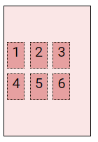
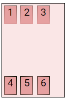

# Web

## CSS Layout

### Float

- 박스를 왼쪽 혹은 오른쪽으로 이동시켜 텍스트를 포함 **인라인 요소들이 주변을 wrapping** 하도록 함
- 요소가 Normal flow를 벗어나도록 함
- 속성
  - `none`: 기본값
  - `left`: 요소를 왼쪽으로 띄움
  - `right`: 요소를 오른쪽으로 띄움

- 예시

  ```html
  <style>
    .box1 {
      width:150px;
      height:150px;
      border: 1px solid black;
    }
    .left {
      float: left;
    }
    .clearfix::after {
      content= "";
      display: block;
      clear: both;
    }
  </style>
  <body>
    <header>
      <div class="box1 left">div</div>
    </header>
    	<div class="box2">div</div>
  </body>
  ```

- Clearing Float
  - Float는 Normal Flow에서 벗어나 부동 상태
  - 따라서, 이후 요소에 대하여 Float 속성이 적용되지 않도록 Clearing이 필수적임(높이가 생김)
    - ::after : 선택한 요소의 맨 마지막 자식으로 가상 요소를 하나 생성
      - 보통 content 속성과 함께 짝지어, 요소에 장식용 콘텐츠를 추가할 때 사용
    - clear 속성 부여

- Float 정리
  - Float는 레이아웃을 구성하기 위해 필수적으로 활용 되었으며, 최근엔 Flexbox, Grid 등장과 함께 사용도가 낮아짐
  - Float 활용 전략 - Normal Flow 에서 벗어난 레이아웃 구성
    - 원하는 요소들을 Float로 지정하여 배치
    - 부모 요소에 반드시 Clearing Float를 하여 이후 요소부터 Normal Flow를 가지도록 지정

### Flex box

- CSS Flexible Box Layout
  - 행과 열 형태로 아이템들을 배치하는 1차원 레이아웃 모델
  - 축
    - `flex-direction : row;` (or `column`)
    - `main axis` (메인 축)
    - `cross axis` (교차 축)
  - 구성 요소
    - `Flex Container` (부모 요소)
      - flexbox 레이아웃을 형성하는 가장 기본적인 모델
      - Flex Item들이 놓여있는 영역
      - `display` 속성을 `flex` 혹은 `inline-flex`로 지정
    - Flex Item (자식 요소)
      - 컨테이너에 속해 있는 컨텐츠(박스)

- 속성

  - 배치 설정
    - `flex-direction`
    - `flex-wrap`

  - 공간 나누기
    - `justify-content` (main axis)
    - `align-content` (cross axis)

  - 정렬
    - `align-items` (모든 아이템을 cross axis 기준으로)
    - `align-self` (개별아이템)

- `flex-direction`

  - Main axis 기준 방향 설정

  - 역방향의 경우 HTML 태그 선언 순서와 시각적으로 다르니 유의(웹 접근성에 영향)

  - **start end 위치가 바뀜**

    |                         row(기본값)                          |                         row-reverse                          |                            column                            |                        column-reverse                        |
    | :----------------------------------------------------------: | :----------------------------------------------------------: | :----------------------------------------------------------: | :----------------------------------------------------------: |
    |  |  |  |  |

- `flex-wrap`

  - 아이템이 컨테이너를 벗어나는 경우 해당 영역 내에 배치되도록 설정

  - 즉, 기본적으로 컨테이너 영역을 벗어나지 않도록 함

    |                             wrap                             |                        nowrap(기본값)                        |
    | :----------------------------------------------------------: | :----------------------------------------------------------: |
    |  |  |

    

- `flex-flow`

  - `flex-direction`, `flex-wrap`의 shorthand

    - 예시 

      > flex-flow: row nowrap;


- `justify-content`

  - **Main axis**를 기준으로 공간 배분

    |                          flex-start                          |                           flex-end                           |                            center                            |                        space-between                         |                         space-around                         |                         space-evenly                         |
    | :----------------------------------------------------------: | :----------------------------------------------------------: | :----------------------------------------------------------: | :----------------------------------------------------------: | :----------------------------------------------------------: | :----------------------------------------------------------: |
    |  |  |  |  |  |  |

- `align-content`

  - **Cross axis**를 기준으로 공간 배분(**아이템이 한줄로 배치되는 경우 확인할 수 없음**)

    |                          flex-start                          |                           flex-end                           |                            center                            |                        space-between                         |                         space-around                         |                         space-evenly                         |
    | :----------------------------------------------------------: | :----------------------------------------------------------: | :----------------------------------------------------------: | :----------------------------------------------------------: | :----------------------------------------------------------: | :----------------------------------------------------------: |
    |  |  |  |  |  |  |

- `align-items`

  - 모든 아이템을 Cross axis를 기준으로 정렬
    
    |                           stretch                            |                          flex-start                          |                           flex-end                           |                            center                            |                           baseline                           |
    | :----------------------------------------------------------: | :----------------------------------------------------------: | :----------------------------------------------------------: | :----------------------------------------------------------: | :----------------------------------------------------------: |
    |  |  |  |  |  |
    
    

- `align-self`

  - 개별 아이템을 Cross axis 기준으로 정렬

    - 해당 속성은 컨테이너에 적용하는 것이 아니라 개별 아이템에 적용

    |                           stretch                            |                          flex-start                          |                           flex-end                           |                            center                            |
    | :----------------------------------------------------------: | :----------------------------------------------------------: | :----------------------------------------------------------: | :----------------------------------------------------------: |
    |  |  |  |  |

    

- `flex-grow` : 남은 영역을 아이템에 분배

- `order` : 배치순서

  ```html
  <div class="flex_item grow-1 order-3">1</div>
  <div class="flex_item grow-1">2</div>
  <div class="flex_item order-3">3</div>
  <div class="flex_item order-2">4</div>
  ```

  

- `flex-shrink` : 영역이 부족할 때 어떻게 축소를 할지

- `flex-basis`: item의 기본 크기 결정(default 0), auto로 설정하면 콘텐츠 길이에 따라 크기가 결정(긴 콘텐츠는 더 길게)

- `flex: grow/shrink/basis` 로 설정할 수 있음

  

##  Bootstrap

- CDN(Content Delivery Network)
  - 컨텐츠(CSS, JS, Image, Text 등) 효율적으로 전달하기 위해 여러 노드에 가진 네트워크에 데이터를 제공하는 시스템

- spacing

  - 브라우저 <html>의 root 글꼴 크기는 16px

    | m      | p       |
    | ------ | ------- |
    | margin | padding |

    | t    | top         |
    | ---- | ----------- |
    | b    | bottom      |
    | s    | left        |
    | e    | right       |
    | x    | left, right |
    | y    | top, bottom |

    | 0    | 0 rem    | 0px  |
    | ---- | -------- | ---- |
    | 1    | 0.25 rem | 4px  |
    | 2    | 0.5 rem  | 8px  |
    | 3    | 1 rem    | 16px |
    | 4    | 1.5 rem  | 24px |
    | 5    | 3 rem    | 48px |

- color

  - 배경색: bg-(색상)
  - 글자색: text-(색상)

- Display

  - d-block
  - d-inline
  - fixed-top
  - fixed-bottom
  - sticky-top
  - d-flex
    - justify-content-start
    - align-items-start
    - align-self-start

- Breakpoints

  | xs     | sm     | md     | lg     | xl      | xxl     |
  | ------ | ------ | ------ | ------ | ------- | ------- |
  | <576px | ≥576px | ≥768px | ≥992px | ≥1200px | ≥1400px |

### bootstrap grid system

- 요소들의 디자인과 배치에 도움을 주는 시스템

- 기본 요소

  - column: 실제 컨텐츠를 포함하는 부분
  - gutter: 칼럼과 칼럼사이의 공간(사이 간격)
  - contatiner :  column들을 담고 있는 공간

- flexbox로 제작됨.

- container, rows, column으로 컨텐츠를 배치하고 정렬

- 12개의 column

- 6개의 grid breakpoints

  

## Responsive web

- 다양한 화면 크기를 가진 디바이스들이 등장함에 따라 reponsive web design 개념이 등장

- 반응형 웹은 별도의 기술 이름이 아닌 웹 디자인에 대한 접근 방식, 반응형 레이아웃 작성에 도움이 되는 사례들의 모음 등을 기술하는데 사용되는 용어

  
